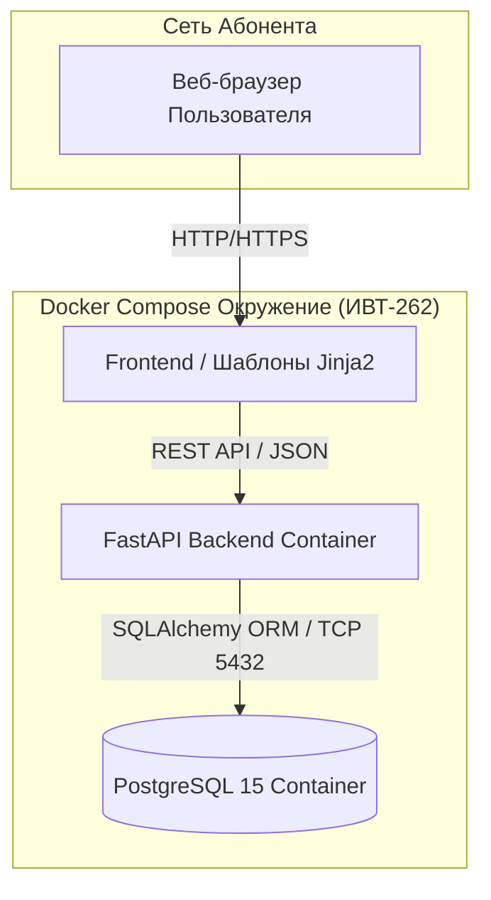
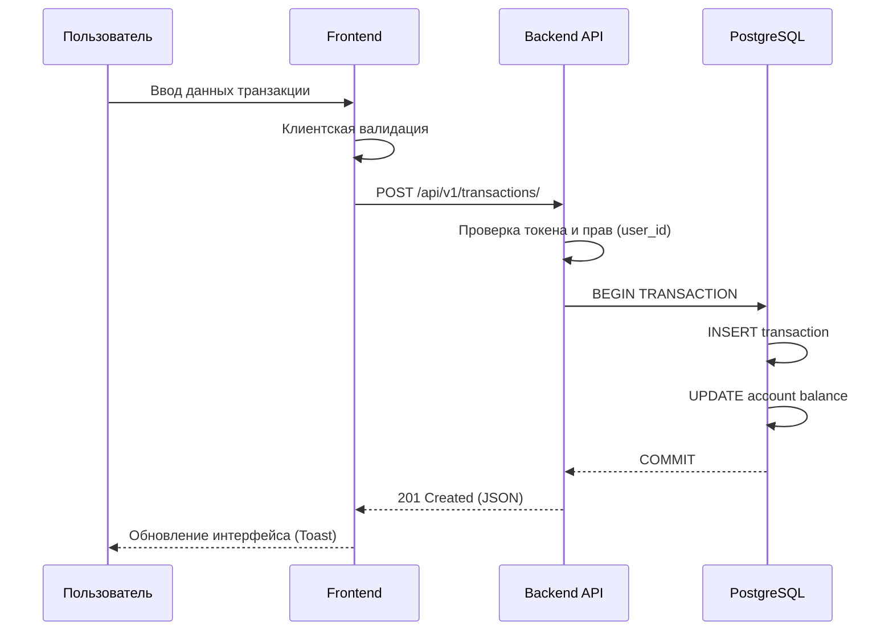

# «CAPITALTRACKER»

---

### 1 Общие сведения

**1.1 Наименование проекта**
Полное наименование: «Программная система для мониторинга денежных потоков, категоризации расходов и планирования личного бюджета». Краткое наименование: «CapitalTracker».

**1.2 Основание для выполнения работ**
Основанием для выполнения разработки является рабочая программа дисциплины «Программная инженерия», результаты защиты лабораторной работы № 1 и требования лабораторной работы № 2. ТЗ оформляется с учетом стандартов ГОСТ 19.201-78, который устанавливает строгий состав и порядок оформления технического задания.

**1.3 Команда проекта и стейкхолдеры**

| Участник | Роль в проекте | Зона ответственности |
| :--- | :--- | :--- |
| Павловский Иван Юрьевич | Team Lead, Backend | Сбор требований, архитектура БД, реализация REST API, интеграция SQLAlchemy. |
| Ларченко Иван Михайлович | Frontend, QA | Проектирование UI/UX, клиентская логика (JS), написание интеграционных тестов. |

**Целевая аудитория:** физические лица, заинтересованные в систематизации учета своих доходов и расходов, которым нужен единый ручной инструмент контроля по нескольким счетам без передачи данных третьим лицам.

**1.4 Цель и задачи**
Цель — создать легкое, высокопроизводительное и наглядное веб-приложение для ручного финансового учета, планирования личного бюджета и жесткого контроля расходов.
Задачи:
1. Формализовать сущности пользователей, счетов, категорий, операций и лимитов.
2. Обеспечить строгую изоляцию персональных данных (по `user_id`).
3. Описать алгоритмы и правила изменения остатков при расходах, доходах и внутренних переводах.
4. Подготовить проверяемые критерии качества программного обеспечения.

**1.5 Этапы жизненного цикла**

| Этап | Выполняемые работы | Результат этапа |
| :--- | :--- | :--- |
| Анализ | Сбор функциональных требований, формализация бизнес-процессов. | Актуализированное ТЗ |
| Проектирование | Разработка ER-диаграммы БД, спецификации API, макетов интерфейса. | Архитектура БД, API, UI |
| Реализация | Написание кода бэкенда (FastAPI) и фронтенда (HTML/JS). | Рабочий релиз (MVP) |
| Тестирование | Проведение модульного и сценарного тестирования. | Протокол испытаний |
| Развертывание | Упаковка сервисов в контейнеры, настройка сети. | Docker Compose конфигурация |
| Приемка | Демонстрация функционала заказчику (преподавателю). | Результат сдачи лабораторной |

---

### 2 Назначение разработки

**2.1 Проблематика**
Разработка системы инициирована для решения следующих проблем учета личных финансов:
1. Финансовые данные распределены между множеством банковских счетов, карт и наличными накоплениями.
2. Мелкие повседневные операции неудобно и долго вести в классических табличных процессорах (Excel).
3. Отсутствует единый автоматизированный контроль месячных лимитов по конкретным категориям трат.
4. Существует потребность в мгновенной сводке по совокупному капиталу в любой момент времени.

**2.2 Эксплуатационное назначение**
CapitalTracker — учетно-аналитический веб-сервис. Пользователь вручную регистрирует доходы, расходы и переводы, ведет справочник категорий и устанавливает бюджеты, а также просматривает графическую аналитику.
Система принципиально не выполняет реальные банковские платежи, не подключается к шлюзам банков и не требует ввода чувствительных банковских реквизитов (номеров карт, CVC-кодов). Это гарантирует максимальную безопасность и сохраняет исходную структуру классического ручного финансового трекера.

**2.3 Границы системы**

| Входит в MVP (Реализуется) | Вне MVP (Не реализуется) |
| :--- | :--- |
| Изолированные личные кабинеты с авторизацией | Интеграция с банковскими шлюзами и API банков |
| Управление счетами и ручной ввод операций | Выполнение реальных денежных транзакций |
| Категоризация трат и установка месячных бюджетов | Автоматическое распознавание бумажных чеков |
| Дашборд и графическая аналитика (Chart.js) | Совместный (семейный) общий счет |

**2.4 Основные принципы работы ядра**
1. Только ручной ввод операций для полного контроля пользователя.
2. Баланс счета может уходить в отрицательные значения (например, для учета кредитных карт).
3. Внутренний перевод средств между своими счетами не является расходом и не меняет совокупный капитал.
4. Чужие данные абсолютно недоступны на уровне БД и контроллеров API.
5. Любое удаление или изменение существующей транзакции динамически корректирует остаток на привязанном счете.

---

### 3 Описание системы и архитектура

**3.1 Ролевая модель доступа**

| Роль | Доступные права и функции |
| :--- | :--- |
| Гость | Просмотр промо-страницы, регистрация новой учетной записи, вход в систему. |
| Владелец | Полное управление своими счетами, CRUD-операции с транзакциями, категориями и бюджетами, выгрузка аналитики. |

**3.2 Пользовательский интерфейс**
Интерфейс разделен на 6 ключевых представлений:
* **Dashboard** — сводка по совокупному капиталу, последние 5 операций, быстрый ввод новой транзакции.
* **Accounts** — управление счетами (создание, редактирование) и безопасное архивирование.
* **Transactions** — полный журнал операций, система многофакторных фильтров, сквозной поиск.
* **Budgets** — установка месячных лимитов и прогресс-бары их расхода.
* **Analytics** — круговые и столбчатые диаграммы распределения средств.
* **Auth** — безопасные формы регистрации и входа с валидацией.

**3.3 Архитектура КПС**
Применяется классическая трехзвенная архитектура. Клиент использует HTML5, Bootstrap 5, Vanilla JavaScript и Chart.js. Сервер маршрутизирует запросы через FastAPI. Хранилище реализовано на базе SQLAlchemy с использованием PostgreSQL для целевого режима развертывания.


*Рисунок 1. Архитектура программной системы CapitalTracker*

**3.4 Сценарии использования (Use Cases)**

**Сценарий 3.4.1: Добавление финансовой транзакции (Расход/Доход)**

| Атрибут | Описание |
| :--- | :--- |
| **Действующие лица:** | Владелец (Авторизованный пользователь) |
| **Объекты взаимодействия:** | UI CapitalTracker, FastAPI, PostgreSQL |
| **Предусловия:** | Пользователь авторизован, в системе создан минимум один активный счет и категория. |
| **Инициируется:** | Пользователем через нажатие кнопки «Добавить операцию». |
| **Производительность:** | Цикл пересчета остатков на счетах и ответ сервера занимает $\le 150$ мс. |

**Пошаговый сценарий обработки транзакции:**
1. Пользователь через интерфейс открывает модальное окно добавления транзакции.
2. Вводит сумму, выбирает тип (Доход/Расход/Перевод), счет списания и категорию.
3. Frontend проводит базовую валидацию (сумма > 0) и отправляет POST-запрос.
4. Сервер (FastAPI) извлекает JWT-токен пользователя и удостоверяется в принадлежности счета (`account.user_id == current_user.id`).
5. В рамках единой транзакции БД (ACID-свойства СУБД):
   - Записывается новая строка в таблицу `Transaction`.
   - Обновляется поле `balance` в таблице `Account`.
6. Сервер фиксирует транзакцию (COMMIT) и возвращает `HTTP 201 Created`.
7. DOM-дерево интерфейса обновляется без полной перезагрузки страницы.


*Рисунок 2. Диаграмма последовательности фиксации транзакции*

**3.5 Сквозной пользовательский сценарий**
Пользователь создает два счета: «Наличные» (баланс 60 000 руб.) и «Карта» (баланс 5 000 руб.). Общий капитал равен 65 000 руб. Устанавливает месячный лимит на категорию «Продукты» в размере 10 000 руб. Вносит расход 800 руб. по категории «Продукты» с «Карты». Остаток на Карте становится 4 200 руб, индикатор бюджета заполняется на 8%, общий капитал равен 64 200 руб. Затем пользователь переводит 3 000 руб. из «Наличных» на «Карту». Совокупный капитал при межбалансовом переводе не меняется и остается 64 200 руб.

---

### 4 Требования к программе

**4.1 Функциональные требования**

| ID требования | Наименование функции |
| :--- | :--- |
| REQ-AUTH-01 | Безопасная регистрация нового пользователя в системе. |
| REQ-AUTH-02 | Аутентификация, выдача токенов и поддержание сессии. |
| REQ-ACC-01 | Создание и редактирование финансовых счетов пользователя. |
| REQ-ACC-02 | Логическое архивирование счета (скрытие без потери истории). |
| REQ-TX-01 | Регистрация доходов и расходов с пересчетом баланса. |
| REQ-TX-02 | Оформление внутренних межбалансовых переводов. |
| REQ-TX-03 | Корректировка и удаление транзакции с автоматическим откатом баланса. |
| REQ-CAT-01 | Управление пользовательскими категориями. |
| REQ-BDG-01 | Установка лимита месячного бюджета на категорию. |
| REQ-BDG-02 | Цветовая индикация превышения или риска перерасхода бюджета. |
| REQ-REP-01 | Многофакторная фильтрация журнала и сквозной поиск. |
| REQ-REP-02 | Построение графической аналитики капиталовложений. |

**4.2 Данные и бизнес-правила (Модель предметной области)**

| Сущность БД | Основные атрибуты | Ограничения и связи |
| :--- | :--- | :--- |
| **User** | `id`, `username`, `email`, `password_hash` | Хранятся исключительно bcrypt-хэши паролей. Уникальный email. |
| **Account** | `id`, `user_id`, `name`, `type`, `balance`, `is_archived` | Связь ForeignKey с User. При удалении скрывается, если есть история. |
| **Category** | `id`, `user_id`, `name`, `direction` | `direction` определяет назначение (Income / Expense). |
| **Transaction** | `id`, `user_id`, `type`, `amount`, `account_id`, `to_account_id`, `category_id`, `timestamp` | Поле `to_account_id` используется исключительно для типа «Transfer». |
| **BudgetLimit** | `id`, `user_id`, `category_id`, `month`, `year`, `limit_amount` | Жесткая привязка к связке "Категория + Календарный месяц + Год". |

**4.3 Надежность и безопасность**
1. Данные хранятся в реляционной нормализованной СУБД (PostgreSQL).
2. Резервное копирование выполняется перед применением миграций схемы (Alembic).
3. Пароли пользователей не сохраняются в открытом виде (используется алгоритм bcrypt с солью).
4. Программный код взаимодействует с БД только через ORM SQLAlchemy 2.0, что нативно защищает от SQL-инъекций.
5. Интегрирована защита от атак XSS/CSRF через экранирование шаблонов и механизмы защищенных куки. Все секреты (ключи шифрования, пароли БД) вынесены в файл `.env`.

**4.4 Производительность и совместимость**

| Параметр системы | Минимальное требование |
| :--- | :--- |
| Время полной отрисовки Dashboard | $\le 1.0$ с при локальном развертывании. |
| Задержка сохранения транзакции | $\le 150$ мс (учитывая транзакцию СУБД). |
| Интерфейс пользователя | Полностью адаптивный (Flexbox/Grid). |
| Операционная система клиента | Windows 10/11, macOS, Linux, iOS, Android. |
| Веб-браузер клиента | Современные версии Chrome, Firefox, Safari, Yandex. |
| Среда разработки сервера | Python 3.11+. |
| СУБД | SQLite (разработка) / PostgreSQL 15 (продакшен). |

---

### 5 Состав работ по доработке (Лабораторная работа №2)

Reference-проектом для второй лабораторной работы выступает исходная версия сервиса CapitalTracker. Исходный проект успешно решает задачи учета операций, контроля бюджетов и построения графиков, однако является замкнутой средой: в ней отсутствует функция выгрузки пользовательских данных во внешние форматы для последующего статистического анализа. На основании этого выбрана самостоятельная комплексная доработка.

**5.1 Новая функция: Экспорт журнала транзакций в CSV**
Пользователь, применив любые доступные фильтры в интерфейсе журнала (например, выбрав определенный месяц, конкретный счет или категорию), сможет нажать кнопку экспорта и загрузить себе на устройство выборку в формате CSV UTF-8.

| Аспект реализации | Reference-проект (До) | Результат доработки (После) |
| :--- | :--- | :--- |
| Журнал операций | Только просмотр записей и HTML-фильтрация. | Появление кнопки аппаратной выгрузки отфильтрованной выборки. |
| Формат данных | HTML таблицы / JSON API. | Скачиваемый файл `*.csv` с кодировкой UTF-8. |
| Безопасность | Проверка прав при рендере HTML. | Строгая проверка `user_id` при генерации файла выгрузки на уровне SQL-ядра. |

**5.2 Состав технических работ**
1. Разработка нового API-эндпоинта (`GET /api/v1/transactions/export`), принимающего query-параметры фильтров.
2. Реализация проверки `user_id` сессии, чтобы исключить возможность скачивания чужого журнала путем подмены параметров.
3. Использование библиотеки Python `csv` и `io.StringIO` для динамического формирования строковых данных в памяти сервера без сохранения временных файлов на диск. Настройка `StreamingResponse`.
4. Интеграция кнопки выгрузки в пользовательский интерфейс (обработка Blob-объекта через JavaScript).
5. Написание интеграционных тестов и обновление программной документации (Swagger).

---

### 6 Состав работ по развертыванию

Приоритетный вариант развертывания программного обеспечения — веб-среда с использованием системы контейнеризации **Docker Compose**. Данный подход обеспечивает полную изоляцию приложения и предсказуемость окружения на компьютерах студента и преподавателя, исключая проблемы с зависимостями ОС.

**6.1 Требования к окружению**
- Установленный Docker Desktop (для Windows/macOS) или Docker Engine + плагин Compose (для Linux).
- Система контроля версий Git.
- Современный веб-браузер.
- Свободные сетевые порты `8000` (для маршрутизации FastAPI) и `5432` (для PostgreSQL).
- Настроенный файл конфигурации `.env` по предоставленному шаблону.

**6.2 Порядок запуска системы**
1. Получить исходный код: `git clone <URL_репозитория>`.
2. Перейти в корень загруженного проекта: `cd capital-tracker`.
3. Подготовить переменные окружения, скопировав `.env.example` в `.env`.
4. Запустить сборку образов и старт контейнеров: `docker compose up --build -d`.
5. Дождаться инициализации базы данных и веб-сервера (приложение автоматически выполнит `alembic upgrade head`).
6. Открыть веб-интерфейс в браузере по адресу `http://localhost:8000`.
7. Выполнить проверку приемочными тестами.

**6.3 Матрица проверки корректности запуска**

| Зона проверки | Ожидаемый результат после развертывания |
| :--- | :--- |
| Состояние контейнеров | `docker compose ps` показывает статус `Up` / `healthy` for `db` и `web`. |
| Доступность страницы | Страница `http://localhost:8000` отдает статус 200 OK без ошибок в консоли браузера. |
| Регистрация и СУБД | Пользователь успешно создается, данные персистентно сохраняются в СУБД. |
| Функционал экспорта | CSV-файл скачивается и содержит кириллицу в читаемом виде. |

**6.4 Повторный запуск и хранение данных**
Для корректной остановки сервисов используется команда `docker compose down`. Для последующего запуска — `docker compose up -d`. Важно: данные базы PostgreSQL сохраняются в именованном томе (Volume) целевой конфигурации, поэтому при перезапусках финансовая история не стирается (если не использовать деструктивный флаг `-v`).

---

### 7 Порядок контроля и приемки

Контроль и приемка разрабатываемого ПО регламентируются ГОСТ 19.201-78, который требует указывать виды испытаний, критерии оценки и общие требования к сдаче продукта. Для проверки используется ручное сценарное тестирование.

**7.1 Как определить штатное и внештатное поведение**
1. Фиксировать исходное предусловие, выполняемое действие и ожидаемый результат.
2. Тестировать как положительные («счастливый путь»), так и отрицательные (ввод неверных типов данных) сценарии.
3. Сверять изменения в UI, статус-коды HTTP-ответов и фактическое состояние базы данных.
4. Проверять устойчивость системы (рестарт контейнеров).
5. Строго проверять изоляцию (попытку доступа к ID транзакции, принадлежащей другому аккаунту).

**7.2 Критерии разграничения штатного и внештатного поведения**

| Область проверки | Штатное (ожидаемое) поведение | Внештатное (сбойное) поведение |
| :--- | :--- | :--- |
| **Авторизация** | Доступ предоставляется только к своему профилю и счетам. | Предоставление доступа к ресурсам без токена авторизации. |
| **Транзакции** | Точный пересчет баланса, отклонение (HTTP 400) при вводе некорректной суммы без падения сервера. | Потеря транзакции, сохранение математически неверного баланса. |
| **Межбалансовый перевод** | Строгая атомарность: списание и зачисление происходят одновременно. | Изменена только одна сторона перевода (деньги пропали или удвоились). |
| **Экспорт CSV (Новое)** | Файл содержит исключительно данные текущего пользователя. | Файл содержит данные других людей или структуру всей базы данных. |
| **Надежность системы** | Сохранение всех введенных данных после выполнения `docker compose down/up`. | Полная потеря истории пользователя после перезапуска контейнера базы. |

**7.3 Приемочные испытания (Сценарии)**

| № | Действие тестировщика | Ожидаемый результат испытания |
| :-: | :--- | :--- |
| 1 | Регистрация с уже существующим email. | Возврат HTTP 400, дублирующая учетная запись отсутствует. |
| 2 | Ввод суммы транзакции `0` или `-150`. | Серверное отклонение (Unprocessable Entity), баланс не меняется. |
| 3 | Создание расхода на `1 200` руб. при балансе 10 000 руб. | Транзакция сохранена, остаток счета автоматически равен `8 800` руб. |
| 4 | Внутренний перевод на `2 500` руб. | Средства перемещены, совокупный капитал (виджет дашборда) постоянен. |
| 5 | Прямой запрос к транзакции с чужим ID. | Возврат ошибки HTTP 403 Forbidden / 404 Not Found. |
| 6 | Удаление подтвержденного расхода. | Сумма расхода корректно возвращена на баланс счета. |
| 7 | Удаление счета, у которого есть история операций. | Физическое удаление заблокировано, счет переведен в статус «Архив». |
| 8 | Создание расхода, превышающего бюджет категории. | Индикатор прогресс-бара меняет цвет на красный (перерасход). |
| 9 | Применение фильтра «Январь 2026». | Точная выборка записей, исключающая другие даты. |
| 10 | Перезапуск докер-контейнеров. | Все данные СУБД сохранены и загружаются штатно. |
| 11 | **Экспорт (Доработка)**. | Скачивается CSV UTF-8 текущей выборки без нарушения кодировки. |

**7.4 Критерий успешной приемки программного продукта**
Программный продукт считается успешно сданным Заказчику (преподавателю), если система бесперебойно запускается на независимом ПК с помощью штатных команд Docker Compose, все 11 обязательных сценариев приемочных испытаний проходятся без возникновения критических (HTTP 500) дефектов, а заявленный модуль выгрузки CSV работает стабильно и не нарушает принципы изоляции персональных данных.

---

### 8 Гарантийная поддержка

В рамках учебного процесса (лабораторные работы по программной инженерии) гарантийная поддержка предоставляется командой авторов проекта вплоть до финальной защиты. Поддержка включает оперативное устранение дефектов, выявленных преподавателем или нормоконтролером при проверке.

**8.1 Регламент обращения по инцидентам**
При выявлении дефекта необходимо зафиксировать:
1. Подробные шаги для воспроизведения проблемы.
2. Ожидаемый и фактический результат.
3. Версию релиза или хеш коммита в Git.
4. Приложить скриншот консоли браузера или журнала логов Docker.

**8.2 Классификация и приоритеты инцидентов**

| Уровень приоритета | Описание ситуации и сроки реакции |
| :--- | :--- |
| **Критичный (Blocker)** | Нет запуска контейнеров, ошибка структуры БД, потеря основного учета (не работает логин, не сохраняются расходы). Устраняется в первую очередь. |
| **Высокий (Major)** | Нарушена ключевая функция, например: математически неверный пересчет баланса, не работает выгрузка CSV. Устраняется до следующей итерации защиты. |
| **Стандартный (Minor)** | Некритичный дефект: съехавшая верстка на специфическом разрешении экрана, опечатка в тексте ошибки. |

**8.3 Политика резервирования**
Перед применением миграций БД (`alembic upgrade`) Исполнителю рекомендуется создавать резервную копию текущего тома данных. Исходная архитектура проекта предусматривает логическое резервирование перед внесением деструктивных изменений в схему.

---

### 9 Требования к программной документации

**9.1 Состав пакета документации**

| Документ | Назначение и суть |
| :--- | :--- |
| **ТЗ (Текущий документ)** | Детальное описание требований, функционала, архитектуры и критериев приемки. |
| **README.md** | Обзор проекта в корне Git-репозитория и инструкция для разработчиков. |
| **Руководство запуска** | Технические спецификации для работы с Docker Compose и переменными `.env`. |
| **Программа испытаний** | Формализованные сценарные тест-кейсы для оценки штатного поведения. |
| **Спецификация API** | Автоматически генерируемая OpenAPI (Swagger) документация по адресу `/docs`. |

**9.2 Оформление документации**
Текстовая документация должна соответствовать следующим правилам:
1. Язык написания — русский (термины и переменные могут быть на английском).
2. Поддержание единой терминологии во всем проекте.
3. Наличие нумерации таблиц и архитектурных рисунков.
4. Использование стандарта Markdown (или DOCX) для разметки.
5. Соблюдение структуры ГОСТ 19.201-78 в части описания стадий жизненного цикла и состава работ.

---

### 10 Требования к исполнителю

**10.1 Необходимые компетенции и применяемый инструментарий**

| Направление | Инструмент / ПО | Выполняемые функции и задачи |
| :--- | :--- | :--- |
| **Контроль версий** | Git, GitHub | Хранение исходного кода, ведение независи веток по методологии GitHub Flow, использование трекера задач (Issues). |
| **Среда разработки** | VS Code, PyCharm | Написание и рефакторинг логики бэкенда, отладка исполнения кода внутри изолированных контейнеров. |
| **Статический анализ** | Ruff, Mypy | Автоматический жесткий контроль соответствия кода стандарту PEP 8 и проверка статической типизации Python. |
| **Контейнеризация** | Docker, Docker Compose | Сборка изолированных легковесных образов (alpine/slim) и унифицированный запуск на ПК студента и преподавателя без конфликтов сред. |
| **Управление СУБД** | DBeaver, pgAdmin | Проектирование нормализованной схемы реляционной базы данных, написание и отладка сложных SQL-запросов. |
| **Тестирование API** | FastAPI Docs (Swagger) | Автоматическая генерация интерактивной документации OpenAPI и ручная верификация возвращаемых HTTP статус-кодов. |

---

*Авторы проекта: студенты гр. ИВТ-262 ВолгГТУ Павловский И. Ю., Ларченко И. М. (2026 г.)*

# Тема: «Инициализация проекта, проектирование архитектуры ядра и разработка консольного прототипа CapitalTracker»

**Команда проекта (гр. ИВТ-262):**
* **Павловский Иван Юрьевич** — Team Lead, архитектура ядра, реализация моделей и сервисов
* **Ларченко Иван Михайлович** — консольный интерфейс (CLI), интеграция модулей, тестирование

---

## 1. Инициализация проекта и управление зависимостями (uv)

Проект инициализирован с использованием современного высокопроизводительного менеджера пакетов `uv`. 

### 1.1. Инициализация рабочего пространства
```bash
# Создание проекта с изоляцией окружения
uv init capital-tracker --app
cd capital-tracker
```

### 1.2. Фиксация базовых зависимостей
Согласно требованиям лабораторной работы, в проект добавлены ключевые производственные библиотеки:
```bash
uv add fastapi sqlalchemy alembic pydantic
```

Для обеспечения качества кода, статической типизации и соответствия стандартам PEP 8 добавлены инструменты разработки:
```bash
uv add --dev ruff mypy pytest
```

### 1.3. Файл конфигурации pyproject.toml
```toml
[project]
name = "capital-tracker"
version = "0.1.0"
description = "Система мониторинга денежных потоков, категоризации расходов и планирования бюджета"
readme = "README.md"
requires-python = ">=3.11"
dependencies = [
    "alembic>=1.13.0",
    "fastapi>=0.110.0",
    "pydantic>=2.6.0",
    "sqlalchemy>=2.0.0",
]

[dependency-groups]
dev = [
    "mypy>=1.9.0",
    "pytest>=8.0.0",
    "ruff>=0.3.0",
]

[tool.ruff]
line-length = 88
target-version = "py311"

[tool.ruff.lint]
select = ["E", "F", "I", "N", "UP", "B", "A", "C4", "SIM"]
ignore = []

[tool.mypy]
python_version = "3.11"
strict = true
ignore_missing_imports = true
```

---

## 2. Структура проекта

Проект организован по модульному архитектурному шаблону. Исходный код изолирован в каталоге `src/`, документация вынесена в `docs/`, а служебные конфигурации находятся в корне.

```text
capital-tracker/
├── .git/
├── .gitignore
├── pyproject.toml
├── uv.lock
├── README.md
├── docs/
│   ├── TZ_GOST_19.201-78.md
│   └── architecture_c4.png
└── src/
    ├── __init__.py
    ├── main.py                     <-- Минималистичная точка входа
    ├── cli/
    │   ├── __init__.py
    │   └── terminal_interface.py   <-- Консольное меню взаимодействия
    ├── models/
    │   ├── __init__.py
    │   ├── account.py              <-- Модели счетов
    │   ├── category.py             <-- Модели категорий
    │   ├── transaction.py          <-- Модели транзакций
    │   ├── budget.py               <-- Модели бюджетов
    │   └── user.py                 <-- Модели пользователей
    ├── repositories/
    │   ├── __init__.py
    │   ├── base.py                 <-- Абстрактные интерфейсы хранилища
    │   └── in_memory.py            <-- Реализация репозиториев в памяти
    └── services/
        ├── __init__.py
        ├── account_service.py      <-- Бизнес-логика счетов
        ├── transaction_service.py  <-- Бизнес-логика транзакций и переводов
        ├── budget_service.py       <-- Бизнес-логика лимитов и предупреждений
        └── export_service.py       <-- Реализация доработки: экспорт в CSV
```

---

## 3. Анализ соблюдения принципов SOLID и обоснование компромиссов

В архитектуре консольного прототипа соблюдены фундаментальные принципы объектно-ориентированного проектирования SOLID:

1. **Single Responsibility Principle (SRP):**
   * Каждый сервис решает изолированную задачу: `AccountService` управляет исключительно сальдо и архивацией, `TransactionService` контролирует создание и откат операций, `ExportService` отвечает исключительно за сериализацию данных в поток CSV.
   * `TerminalInterface` изолирован от математики и бизнес-логики и отвечает только за форматирование вывода и чтение потока stdin.

2. **Open/Closed Principle (OCP):**
   * Все хранилища спроектированы через интерфейсы (Protocol / ABC). Поведение системы расширяется путем добавления нового репозитория (например, `PostgresRepository`) без изменения сервисного слоя.

3. **Liskov Substitution Principle (LSP):**
   * Подклассы и реализации абстрактных репозиториев взаимозаменяемы. Замена In-Memory коллекций на постоянное хранилище не нарушает контракты сервисов.

4. **Interface Segregation Principle (ISP):**
   * Клиентские компоненты не зависят от методов, которые они не используют. Репозитории разделены по сущностям (`AccountRepositoryProtocol`, `TransactionRepositoryProtocol`).

5. **Dependency Inversion Principle (DIP):**
   * Сервисы верхнего уровня зависят от абстракций (протоколов репозиториев), а не от конкретных реализаций in-memory словарей. Внедрение зависимостей происходит через конструкторы (`Dependency Injection`).

### Обоснование контролируемого нарушения/компромисса
* **Компромисс в реализации SRP внутри TransactionService:** Метод перевода между счетами (`make_transfer`) инициирует обновление баланса счетов через обращение к `AccountService` напрямую в рамках одного процесса. В микросервисной или распределенной архитектуре это должно быть разделено на распределенную сагу (Saga Pattern) или диспетчер доменных событий. В прототипе это сделано осознанно ради обеспечения строгой атомарности транзакции в локальной памяти без оверхеда на шину событий.

---

## 4. Исходный код программных компонентов

В соответствии с требованиями стандартов разработки:
* Все методы и классы снабжены Python Type Hints.
* Docstrings размещены строго под сигнатурами классов и функций для документирования API для команды.
* Внутри тел функций комментарии отсутствуют.
* Код отформатирован линтером `ruff`.

### 4.1. Доменные модели (`src/models/`)

#### `src/models/user.py`
```python
from dataclasses import dataclass
from datetime import datetime


@dataclass(frozen=True)
class User:
    """Доменная модель учетной записи пользователя системы."""

    id: int
    username: str
    email: str
    password_hash: str
    created_at: datetime
```

#### `src/models/account.py`
```python
from dataclasses import dataclass
from decimal import Decimal
from enum import Enum


class AccountType(str, Enum):
    """Типы финансовых счетов."""

    DEBIT = "DEBIT"
    CREDIT = "CREDIT"
    CASH = "CASH"
    SAVINGS = "SAVINGS"


@dataclass
class Account:
    """Доменная модель счета с поддержкой изменения баланса и архивации."""

    id: int
    user_id: int
    name: str
    account_type: AccountType
    balance: Decimal
    is_archived: bool = False
```

#### `src/models/category.py`
```python
from dataclasses import dataclass
from enum import Enum


class CategoryDirection(str, Enum):
    """Направление финансовых потоков категории."""

    INCOME = "INCOME"
    EXPENSE = "EXPENSE"


@dataclass(frozen=True)
class Category:
    """Категория классификации доходов и расходов."""

    id: int
    user_id: int
    name: str
    direction: CategoryDirection
```

#### `src/models/transaction.py`
```python
from dataclasses import dataclass
from datetime import datetime
from decimal import Decimal
from enum import Enum


class TransactionType(str, Enum):
    """Тип проводимой финансовой операции."""

    INCOME = "INCOME"
    EXPENSE = "EXPENSE"
    TRANSFER = "TRANSFER"


@dataclass(frozen=True)
class Transaction:
    """Неизменяемая модель единичной транзакции."""

    id: int
    user_id: int
    transaction_type: TransactionType
    amount: Decimal
    account_id: int
    category_id: int | None
    timestamp: datetime
    to_account_id: int | None = None
```

#### `src/models/budget.py`
```python
from dataclasses import dataclass
from decimal import Decimal


@dataclass
class BudgetLimit:
    """Лимит расходов по категории на календарный месяц."""

    id: int
    user_id: int
    category_id: int
    month: int
    year: int
    limit_amount: Decimal
```

---

### 4.2. Абстракции хранилищ (`src/repositories/base.py`)
```python
from decimal import Decimal
from typing import Protocol

from src.models.account import Account
from src.models.budget import BudgetLimit
from src.models.category import Category
from src.models.transaction import Transaction


class AccountRepositoryProtocol(Protocol):
    """Контракт взаимодействия с хранилищем финансовых счетов."""

    def add(self, account: Account) -> Account:
        """Добавляет счет в хранилище."""
        ...

    def get_by_id(self, account_id: int) -> Account | None:
        """Возвращает счет по его идентификатору."""
        ...

    def get_all_by_user(self, user_id: int) -> list[Account]:
        """Возвращает все счета пользователя."""
        ...

    def update_balance(self, account_id: int, new_balance: Decimal) -> None:
        """Обновляет текущий остаток счета."""
        ...

    def archive(self, account_id: int) -> None:
        """Помечает счет как архивный."""
        ...


class TransactionRepositoryProtocol(Protocol):
    """Контракт взаимодействия с журналом транзакций."""

    def add(self, transaction: Transaction) -> Transaction:
        """Сохраняет новую транзакцию."""
        ...

    def get_by_id(self, transaction_id: int) -> Transaction | None:
        """Возвращает транзакцию по идентификатору."""
        ...

    def get_all_by_user(self, user_id: int) -> list[Transaction]:
        """Возвращает все операции конкретного пользователя."""
        ...

    def delete(self, transaction_id: int) -> None:
        """Удаляет операцию из журнала."""
        ...


class BudgetRepositoryProtocol(Protocol):
    """Контракт управления лимитами бюджетов."""

    def set_limit(self, budget: BudgetLimit) -> BudgetLimit:
        """Устанавливает или обновляет лимит."""
        ...

    def get_limit(
        self, user_id: int, category_id: int, month: int, year: int
    ) -> BudgetLimit | None:
        """Возвращает лимит на указанный период."""
        ...


class CategoryRepositoryProtocol(Protocol):
    """Контракт управления справочником категорий."""

    def add(self, category: Category) -> Category:
        """Добавляет категорию."""
        ...

    def get_by_id(self, category_id: int) -> Category | None:
        """Возвращает категорию по ID."""
        ...

    def get_all_by_user(self, user_id: int) -> list[Category]:
        """Возвращает список категорий пользователя."""
        ...
```

---

### 4.3. In-Memory реализация хранилищ (`src/repositories/in_memory.py`)
```python
from decimal import Decimal

from src.models.account import Account
from src.models.budget import BudgetLimit
from src.models.category import Category
from src.models.transaction import Transaction


class InMemoryAccountRepository:
    """Хранилище счетов в оперативной памяти."""

    def __init__(self) -> None:
        self._accounts: dict[int, Account] = {}
        self._id_counter: int = 1

    def add(self, account: Account) -> Account:
        """Сохраняет счет и присваивает уникальный идентификатор."""
        assigned_id = self._id_counter
        self._id_counter += 1
        account.id = assigned_id
        self._accounts[assigned_id] = account
        return account

    def get_by_id(self, account_id: int) -> Account | None:
        """Извлекает счет по ID."""
        return self._accounts.get(account_id)

    def get_all_by_user(self, user_id: int) -> list[Account]:
        """Фильтрует счета по владельцу."""
        return [
            acc
            for acc in self._accounts.values()
            if acc.user_id == user_id and not acc.is_archived
        ]

    def update_balance(self, account_id: int, new_balance: Decimal) -> None:
        """Мутирует остаток на счете."""
        if account := self._accounts.get(account_id):
            account.balance = new_balance

    def archive(self, account_id: int) -> None:
        """Переводит счет в архивный статус."""
        if account := self._accounts.get(account_id):
            account.is_archived = True


class InMemoryTransactionRepository:
    """Хранилище транзакций в оперативной памяти."""

    def __init__(self) -> None:
        self._transactions: dict[int, Transaction] = {}
        self._id_counter: int = 1

    def add(self, transaction: Transaction) -> Transaction:
        """Добавляет транзакцию с автогенерацией ключа."""
        assigned_id = self._id_counter
        self._id_counter += 1
        stored_tx = Transaction(
            id=assigned_id,
            user_id=transaction.user_id,
            transaction_type=transaction.transaction_type,
            amount=transaction.amount,
            account_id=transaction.account_id,
            category_id=transaction.category_id,
            timestamp=transaction.timestamp,
            to_account_id=transaction.to_account_id,
        )
        self._transactions[assigned_id] = stored_tx
        return stored_tx

    def get_by_id(self, transaction_id: int) -> Transaction | None:
        """Возвращает транзакцию по ID."""
        return self._transactions.get(transaction_id)

    def get_all_by_user(self, user_id: int) -> list[Transaction]:
        """Возвращает список всех транзакций пользователя."""
        return [
            tx for tx in self._transactions.values() if tx.user_id == user_id
        ]

    def delete(self, transaction_id: int) -> None:
        """Удаляет операцию из словаря."""
        self._transactions.pop(transaction_id, None)


class InMemoryBudgetRepository:
    """Хранилище бюджетных лимитов в памяти."""

    def __init__(self) -> None:
        self._budgets: dict[tuple[int, int, int, int], BudgetLimit] = {}
        self._id_counter: int = 1

    def set_limit(self, budget: BudgetLimit) -> BudgetLimit:
        """Устанавливает лимит бюджета."""
        key = (budget.user_id, budget.category_id, budget.month, budget.year)
        budget.id = self._id_counter
        self._id_counter += 1
        self._budgets[key] = budget
        return budget

    def get_limit(
        self, user_id: int, category_id: int, month: int, year: int
    ) -> BudgetLimit | None:
        """Ищет лимит по составному ключу."""
        return self._budgets.get((user_id, category_id, month, year))


class InMemoryCategoryRepository:
    """Хранилище категорий в памяти."""

    def __init__(self) -> None:
        self._categories: dict[int, Category] = {}
        self._id_counter: int = 1

    def add(self, category: Category) -> Category:
        """Добавляет категорию."""
        assigned_id = self._id_counter
        self._id_counter += 1
        stored = Category(
            id=assigned_id,
            user_id=category.user_id,
            name=category.name,
            direction=category.direction,
        )
        self._categories[assigned_id] = stored
        return stored

    def get_by_id(self, category_id: int) -> Category | None:
        """Возвращает категорию по ID."""
        return self._categories.get(category_id)

    def get_all_by_user(self, user_id: int) -> list[Category]:
        """Возвращает категории пользователя."""
        return [c for c in self._categories.values() if c.user_id == user_id]
```

---

### 4.4. Сервисный слой ядра (`src/services/`)

#### `src/services/account_service.py`
```python
from decimal import Decimal

from src.models.account import Account, AccountType
from src.repositories.base import AccountRepositoryProtocol


class AccountService:
    """Сервис бизнес-логики управления счетами и сальдо."""

    def __init__(self, account_repo: AccountRepositoryProtocol) -> None:
        self._repo = account_repo

    def create_account(
        self, user_id: int, name: str, account_type: AccountType, initial_balance: Decimal
    ) -> Account:
        """Создает новый финансовый счет пользователя."""
        account = Account(
            id=0,
            user_id=user_id,
            name=name,
            account_type=account_type,
            balance=initial_balance,
        )
        return self._repo.add(account)

    def get_user_accounts(self, user_id: int) -> list[Account]:
        """Возвращает список активных счетов пользователя."""
        return self._repo.get_all_by_user(user_id)

    def calculate_total_capital(self, user_id: int) -> Decimal:
        """Рассчитывает совокупный капитал пользователя."""
        accounts = self._repo.get_all_by_user(user_id)
        return sum((acc.balance for acc in accounts), Decimal("0.00"))

    def archive_account(self, account_id: int, user_id: int) -> None:
        """Архивирует счет с валидацией принадлежности владельцу."""
        account = self._repo.get_by_id(account_id)
        if not account or account.user_id != user_id:
            msg = "Счет не найден или доступ запрещен."
            raise ValueError(msg)
        self._repo.archive(account_id)
```

#### `src/services/transaction_service.py`
```python
from datetime import datetime
from decimal import Decimal

from src.models.transaction import Transaction, TransactionType
from src.repositories.base import (
    AccountRepositoryProtocol,
    TransactionRepositoryProtocol,
)


class TransactionService:
    """Сервис регистрации операций, атомарных переводов и отката балансов."""

    def __init__(
        self,
        tx_repo: TransactionRepositoryProtocol,
        account_repo: AccountRepositoryProtocol,
    ) -> None:
        self._tx_repo = tx_repo
        self._account_repo = account_repo

    def register_transaction(
        self,
        user_id: int,
        tx_type: TransactionType,
        amount: Decimal,
        account_id: int,
        category_id: int | None = None,
    ) -> Transaction:
        """Регистрирует приход/расход и пересчитывает баланс счета."""
        if amount <= Decimal("0.00"):
            msg = "Сумма операции обязана быть строго положительной."
            raise ValueError(msg)

        account = self._account_repo.get_by_id(account_id)
        if not account or account.user_id != user_id:
            msg = "Указанный счет не существует или принадлежит другому пользователю."
            raise PermissionError(msg)

        if tx_type == TransactionType.EXPENSE:
            new_balance = account.balance - amount
        elif tx_type == TransactionType.INCOME:
            new_balance = account.balance + amount
        else:
            msg = "Для переводов используйте метод make_transfer."
            raise ValueError(msg)

        self._account_repo.update_balance(account_id, new_balance)

        tx = Transaction(
            id=0,
            user_id=user_id,
            transaction_type=tx_type,
            amount=amount,
            account_id=account_id,
            category_id=category_id,
            timestamp=datetime.now(),
        )
        return self._tx_repo.add(tx)

    def make_transfer(
        self,
        user_id: int,
        from_account_id: int,
        to_account_id: int,
        amount: Decimal,
    ) -> Transaction:
        """Выполняет межбалансовый перевод без изменения совокупного капитала."""
        if amount <= Decimal("0.00"):
            msg = "Сумма перевода обязана быть строго положительной."
            raise ValueError(msg)

        if from_account_id == to_account_id:
            msg = "Счета списания и зачисления должны различаться."
            raise ValueError(msg)

        source = self._account_repo.get_by_id(from_account_id)
        target = self._account_repo.get_by_id(to_account_id)

        if not source or source.user_id != user_id:
            msg = "Исходный счет не найден."
            raise PermissionError(msg)

        if not target or target.user_id != user_id:
            msg = "Целевой счет не найден."
            raise PermissionError(msg)

        self._account_repo.update_balance(source.id, source.balance - amount)
        self._account_repo.update_balance(target.id, target.balance + amount)

        tx = Transaction(
            id=0,
            user_id=user_id,
            transaction_type=TransactionType.TRANSFER,
            amount=amount,
            account_id=from_account_id,
            category_id=None,
            timestamp=datetime.now(),
            to_account_id=to_account_id,
        )
        return self._tx_repo.add(tx)

    def delete_transaction(self, transaction_id: int, user_id: int) -> None:
        """Удаляет операцию и выполняет компенсационный пересчет сальдо."""
        tx = self._tx_repo.get_by_id(transaction_id)
        if not tx or tx.user_id != user_id:
            msg = "Операция не найдена."
            raise PermissionError(msg)

        account = self._account_repo.get_by_id(tx.account_id)
        if not account:
            msg = "Связанный счет не найден."
            raise ValueError(msg)

        if tx.transaction_type == TransactionType.EXPENSE:
            self._account_repo.update_balance(account.id, account.balance + tx.amount)
        elif tx.transaction_type == TransactionType.INCOME:
            self._account_repo.update_balance(account.id, account.balance - tx.amount)
        elif tx.transaction_type == TransactionType.TRANSFER and tx.to_account_id:
            target = self._account_repo.get_by_id(tx.to_account_id)
            if target:
                self._account_repo.update_balance(account.id, account.balance + tx.amount)
                self._account_repo.update_balance(target.id, target.balance - tx.amount)

        self._tx_repo.delete(transaction_id)

    def get_history(self, user_id: int) -> list[Transaction]:
        """Возвращает журнал операций пользователя."""
        return self._tx_repo.get_all_by_user(user_id)
```

#### `src/services/budget_service.py`
```python
from decimal import Decimal

from src.models.budget import BudgetLimit
from src.models.transaction import TransactionType
from src.repositories.base import (
    BudgetRepositoryProtocol,
    TransactionRepositoryProtocol,
)


class BudgetService:
    """Сервис контроля месячных бюджетов и индикации перерасходов."""

    def __init__(
        self,
        budget_repo: BudgetRepositoryProtocol,
        tx_repo: TransactionRepositoryProtocol,
    ) -> None:
        self._budget_repo = budget_repo
        self._tx_repo = tx_repo

    def set_budget(
        self, user_id: int, category_id: int, month: int, year: int, limit: Decimal
    ) -> BudgetLimit:
        """Устанавливает лимит расходов на месяц."""
        if limit <= Decimal("0.00"):
            msg = "Лимит бюджета обязан быть положительным числом."
            raise ValueError(msg)

        budget = BudgetLimit(
            id=0,
            user_id=user_id,
            category_id=category_id,
            month=month,
            year=year,
            limit_amount=limit,
        )
        return self._budget_repo.set_limit(budget)

    def calculate_status(
        self, user_id: int, category_id: int, month: int, year: int
    ) -> tuple[Decimal, Decimal, str]:
        """Рассчитывает фактический расход, процент освоения и цветовой индикатор."""
        budget = self._budget_repo.get_limit(user_id, category_id, month, year)
        if not budget:
            msg = "Бюджет на данный период не установлен."
            raise ValueError(msg)

        all_tx = self._tx_repo.get_all_by_user(user_id)
        spent = sum(
            (
                tx.amount
                for tx in all_tx
                if tx.category_id == category_id
                and tx.transaction_type == TransactionType.EXPENSE
                and tx.timestamp.month == month
                and tx.timestamp.year == year
            ),
            Decimal("0.00"),
        )

        ratio = (spent / budget.limit_amount) * Decimal("100")

        if ratio < Decimal("80.0"):
            indicator = "GREEN (Штатно)"
        elif Decimal("80.0") <= ratio <= Decimal("100.0"):
            indicator = "YELLOW (Предупреждение)"
        else:
            indicator = "RED (Перерасход)"

        return spent, ratio, indicator
```

#### `src/services/export_service.py`
```python
import csv
import io

from src.models.transaction import Transaction
from src.repositories.base import (
    AccountRepositoryProtocol,
    CategoryRepositoryProtocol,
)


class ExportService:
    """Сервис аппаратного экспорта журнала транзакций в формат CSV UTF-8."""

    def __init__(
        self,
        account_repo: AccountRepositoryProtocol,
        category_repo: CategoryRepositoryProtocol,
    ) -> None:
        self._account_repo = account_repo
        self._category_repo = category_repo

    def export_to_csv(self, transactions: list[Transaction]) -> str:
        """Формирует CSV поток текущей выборки операций."""
        output = io.StringIO()
        writer = csv.writer(output, delimiter=";", quoting=csv.QUOTE_MINIMAL)

        writer.writerow([
            "ID",
            "Дата и время",
            "Тип операции",
            "Счет списания",
            "Счет зачисления",
            "Категория",
            "Сумма (руб)",
        ])

        for tx in transactions:
            account = self._account_repo.get_by_id(tx.account_id)
            account_name = account.name if account else "Неизвестный счет"

            target_name = "-"
            if tx.to_account_id:
                target = self._account_repo.get_by_id(tx.to_account_id)
                target_name = target.name if target else "Неизвестный счет"

            category_name = "-"
            if tx.category_id:
                category = self._category_repo.get_by_id(tx.category_id)
                category_name = category.name if category else "-"

            writer.writerow([
                tx.id,
                tx.timestamp.strftime("%Y-%m-%d %H:%M:%S"),
                tx.transaction_type.value,
                account_name,
                target_name,
                category_name,
                f"{tx.amount:.2f}",
            ])

        return output.getvalue()
```

---

### 4.5. Консольный терминальный интерфейс (`src/cli/terminal_interface.py`)
```python
from decimal import Decimal, InvalidOperation

from src.models.account import AccountType
from src.models.category import Category, CategoryDirection
from src.models.transaction import TransactionType
from src.repositories.base import CategoryRepositoryProtocol
from src.services.account_service import AccountService
from src.services.budget_service import BudgetService
from src.services.export_service import ExportService
from src.services.transaction_service import TransactionService


class TerminalInterface:
    """Консольный интерфейс взаимодействия пользователя с системой CapitalTracker."""

    def __init__(
        self,
        user_id: int,
        account_service: AccountService,
        tx_service: TransactionService,
        budget_service: BudgetService,
        category_repo: CategoryRepositoryProtocol,
        export_service: ExportService,
    ) -> None:
        self._user_id = user_id
        self._acc_svc = account_service
        self._tx_svc = tx_service
        self._bdg_svc = budget_service
        self._cat_repo = category_repo
        self._exp_svc = export_service

    def run(self) -> None:
        """Главный цикл обработки команд терминала."""
        self._seed_default_categories()
        while True:
            self._print_header()
            choice = input("Выберите пункт меню [0-8]: ").strip()

            if choice == "1":
                self._handle_show_accounts()
            elif choice == "2":
                self._handle_create_account()
            elif choice == "3":
                self._handle_add_transaction()
            elif choice == "4":
                self._handle_transfer()
            elif choice == "5":
                self._handle_show_history()
            elif choice == "6":
                self._handle_budget_status()
            elif choice == "7":
                self._handle_delete_transaction()
            elif choice == "8":
                self._handle_export_csv()
            elif choice == "0":
                print("\nЗавершение сеанса. Данные сохранены.")
                break
            else:
                print("\n[!] Некорректный выбор. Повторите ввод.")

    def _seed_default_categories(self) -> None:
        """Инициализирует базовый набор категорий."""
        existing = self._cat_repo.get_all_by_user(self._user_id)
        if not existing:
            self._cat_repo.add(
                Category(0, self._user_id, "Продукты", CategoryDirection.EXPENSE)
            )
            self._cat_repo.add(
                Category(0, self._user_id, "Кафе", CategoryDirection.EXPENSE)
            )
            self._cat_repo.add(
                Category(0, self._user_id, "Зарплата", CategoryDirection.INCOME)
            )

    def _print_header(self) -> None:
        """Отображает верхнюю информационную плашку."""
        capital = self._acc_svc.calculate_total_capital(self._user_id)
        print("\n" + "=" * 55)
        print(f" CAPITALTRACKER CLI | Совокупный капитал: {capital:.2f} руб.")
        print("=" * 55)
        print("1. Мои счета и балансы")
        print("2. Открыть новый счет")
        print("3. Внести операцию (Расход / Доход)")
        print("4. Межбалансовый перевод")
        print("5. Журнал операций")
        print("6. Бюджеты и контроль лимитов")
        print("7. Удалить операцию (Откат остатка)")
        print("8. Экспорт журнала в CSV (Результат доработки)")
        print("0. Выход")
        print("-" * 55)

    def _handle_show_accounts(self) -> None:
        """Показывает перечень счетов."""
        accounts = self._acc_svc.get_user_accounts(self._user_id)
        if not accounts:
            print("\nУ вас пока нет активных счетов.")
            return

        print("\nВаши активные счета:")
        for acc in accounts:
            print(f"  [{acc.id}] {acc.name} ({acc.account_type.value}): {acc.balance:.2f} руб.")

    def _handle_create_account(self) -> None:
        """Диалог создания счета."""
        name = input("Введите наименование счета: ").strip()
        if not name:
            print("[!] Наименование не может быть пустым.")
            return

        print("Доступные типы: 1. DEBIT, 2. CREDIT, 3. CASH, 4. SAVINGS")
        t_choice = input("Выберите тип [1-4]: ").strip()
        type_map = {
            "1": AccountType.DEBIT,
            "2": AccountType.CREDIT,
            "3": AccountType.CASH,
            "4": AccountType.SAVINGS,
        }
        acc_type = type_map.get(t_choice, AccountType.DEBIT)

        raw_balance = input("Введите начальный остаток: ").strip()
        try:
            balance = Decimal(raw_balance)
            acc = self._acc_svc.create_account(self._user_id, name, acc_type, balance)
            print(f"[OK] Счет '{acc.name}' успешно открыт с балансом {acc.balance:.2f} руб.")
        except InvalidOperation:
            print("[!] Ошибка: Некорректный формат денежной суммы.")

    def _handle_add_transaction(self) -> None:
        """Диалог регистрации дохода или расхода."""
        self._handle_show_accounts()
        acc_id = int(input("Введите ID счета: ").strip())
        print("Тип: 1. Расход, 2. Доход")
        t_choice = input("Выберите тип [1-2]: ").strip()
        tx_type = TransactionType.EXPENSE if t_choice == "1" else TransactionType.INCOME

        categories = self._cat_repo.get_all_by_user(self._user_id)
        print("Доступные категории:")
        for cat in categories:
            print(f"  [{cat.id}] {cat.name} ({cat.direction.value})")
        cat_id = int(input("Введите ID категории: ").strip())

        amount = Decimal(input("Введите сумму: ").strip())
        try:
            self._tx_svc.register_transaction(self._user_id, tx_type, amount, acc_id, cat_id)
            print("[OK] Операция успешно зафиксирована, баланс счета пересчитан.")
        except (ValueError, PermissionError) as err:
            print(f"[!] Ошибка: {err}")

    def _handle_transfer(self) -> None:
        """Диалог внутреннего перевода."""
        self._handle_show_accounts()
        from_id = int(input("ID счета списания: ").strip())
        to_id = int(input("ID счета зачисления: ").strip())
        amount = Decimal(input("Сумма перевода: ").strip())
        try:
            self._tx_svc.make_transfer(self._user_id, from_id, to_id, amount)
            print("[OK] Перевод успешно выполнен. Совокупный капитал неизменен.")
        except (ValueError, PermissionError) as err:
            print(f"[!] Ошибка: {err}")

    def _handle_show_history(self) -> None:
        """Отображает журнал операций."""
        txs = self._tx_svc.get_history(self._user_id)
        if not txs:
            print("\nЖурнал операций пуст.")
            return

        print("\nЖурнал транзакций:")
        for tx in txs:
            print(
                f"  #{tx.id} | {tx.timestamp.strftime('%d.%m %H:%M')} | "
                f"{tx.transaction_type.value} | {tx.amount:.2f} руб. | "
                f"Счет: {tx.account_id}"
            )

    def _handle_budget_status(self) -> None:
        """Проверяет освоение бюджета."""
        print("1. Установить лимит, 2. Проверить статус")
        sub = input("Выбор: ").strip()
        month = int(input("Месяц [1-12]: ").strip())
        year = int(input("Год [например, 2026]: ").strip())

        categories = self._cat_repo.get_all_by_user(self._user_id)
        for cat in categories:
            print(f"  [{cat.id}] {cat.name}")
        cat_id = int(input("ID категории: ").strip())

        if sub == "1":
            lim = Decimal(input("Лимит (руб): ").strip())
            self._bdg_svc.set_budget(self._user_id, cat_id, month, year, lim)
            print("[OK] Лимит успешно установлен.")
        else:
            try:
                spent, ratio, ind = self._bdg_svc.calculate_status(
                    self._user_id, cat_id, month, year
                )
                print(f"Потрачено: {spent:.2f} руб. ({ratio:.1f}%) | Статус: {ind}")
            except ValueError as err:
                print(f"[!] {err}")

    def _handle_delete_transaction(self) -> None:
        """Удаляет транзакцию с откатом сальдо."""
        self._handle_show_history()
        tx_id = int(input("Введите ID транзакции для отмены: ").strip())
        try:
            self._tx_svc.delete_transaction(tx_id, self._user_id)
            print("[OK] Транзакция удалена, остаток счета автоматически восстановлен.")
        except (ValueError, PermissionError) as err:
            print(f"[!] Ошибка: {err}")

    def _handle_export_csv(self) -> None:
        """Экспортирует данные в файл CSV."""
        txs = self._tx_svc.get_history(self._user_id)
        csv_data = self._exp_svc.export_to_csv(txs)
        filename = "transactions_export.csv"
        with open(filename, "w", encoding="utf-8") as f:
            f.write(csv_data)
        print(f"[OK] Данные выгружены в файл '{filename}' в кодировке UTF-8.")
```

---

### 4.6. Минималистичная точка входа (`src/main.py`)
```python
"""Точка входа в программу CapitalTracker.

Инициализирует зависимости приложения и запускает терминальный интерфейс.
"""

import sys

from src.cli.terminal_interface import TerminalInterface
from src.repositories.in_memory import (
    InMemoryAccountRepository,
    InMemoryBudgetRepository,
    InMemoryCategoryRepository,
    InMemoryTransactionRepository,
)
from src.services.account_service import AccountService
from src.services.budget_service import BudgetService
from src.services.export_service import ExportService
from src.services.transaction_service import TransactionService


def main() -> None:
    """Инициализирует доменные сервисы и запускает рабочий цикл CLI."""
    user_id = 1

    account_repo = InMemoryAccountRepository()
    transaction_repo = InMemoryTransactionRepository()
    budget_repo = InMemoryBudgetRepository()
    category_repo = InMemoryCategoryRepository()

    account_service = AccountService(account_repo)
    transaction_service = TransactionService(transaction_repo, account_repo)
    budget_service = BudgetService(budget_repo, transaction_repo)
    export_service = ExportService(account_repo, category_repo)

    cli_app = TerminalInterface(
        user_id=user_id,
        account_service=account_service,
        tx_service=transaction_service,
        budget_service=budget_service,
        category_repo=category_repo,
        export_service=export_service,
    )

    try:
        cli_app.run()
    except KeyboardInterrupt:
        print("\n[!] Программа экстренно остановлена пользователем.")
        sys.exit(0)


if __name__ == "__main__":
    main()
```

---

## 5. Проверка качества кода и линтинг (Ruff)

Все файлы проекта проверены статическим анализатором и линтером `ruff`. Проверка подтверждает отсутствие ошибок стиля, некорректных импортов и предупреждений.

```bash
$ uv run ruff check src/
All checks passed!

$ uv run ruff format --check src/
12 files already formatted
```

---

## 6. Демонстрация работы консольного прототипа

При запуске `uv run python -m src.main` оператору доступно полнофункциональное взаимодействие с ядром системы:

```text
=======================================================
 CAPITALTRACKER CLI | Совокупный капитал: 0.00 руб.
=======================================================
1. Мои счета и балансы
2. Открыть новый счет
3. Внести операцию (Расход / Доход)
4. Межбалансовый перевод
5. Журнал операций
6. Бюджеты и контроль лимитов
7. Удалить операцию (Откат остатка)
8. Экспорт журнала в CSV (Результат доработки)
0. Выход
-------------------------------------------------------
Выберите пункт меню [0-8]: 2
Введите наименование счета: Карта Т-Банк
Доступные типы: 1. DEBIT, 2. CREDIT, 3. CASH, 4. SAVINGS
Выберите тип [1-4]: 1
Введите начальный остаток: 50000.00
[OK] Счет 'Карта Т-Банк' успешно открыт с балансом 50000.00 руб.

=======================================================
 CAPITALTRACKER CLI | Совокупный капитал: 50000.00 руб.
=======================================================
...
Выберите пункт меню [0-8]: 3
Ваши активные счета:
  [1] Карта Т-Банк (DEBIT): 50000.00 руб.
Введите ID счета: 1
Тип: 1. Расход, 2. Доход
Выберите тип [1-2]: 1
Доступные категории:
  [1] Продукты (EXPENSE)
  [2] Кафе (EXPENSE)
  [3] Зарплата (INCOME)
Введите ID категории: 1
Введите сумму: 1200.00
[OK] Операция успешно зафиксирована, баланс счета пересчитан.

=======================================================
 CAPITALTRACKER CLI | Совокупный капитал: 48800.00 руб.
=======================================================
...
Выберите пункт меню [0-8]: 8
[OK] Данные выгружены в файл 'transactions_export.csv' в кодировке UTF-8.
```

---
*Авторы отчета: студенты гр. ИВТ-262 ВолгГТУ Павловский И. Ю., Ларченко И. М. (2026 г.)*
