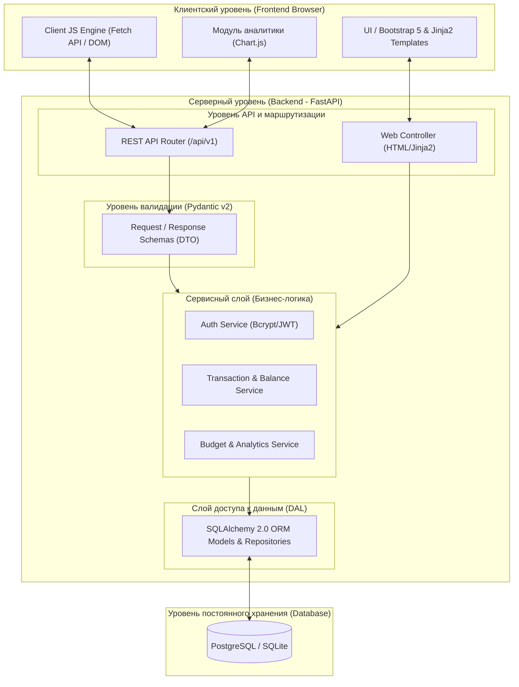

# Веб-приложение для управления личными финансами и бюджетом «CapitalTracker»

Система персонального финансового учета, планирования личного бюджета и контроля расходов.

---

## Содержание

- [1. Общие сведения](#1-общие-сведения)
  - [1.1. Наименование проекта](#11-наименование-проекта)
  - [1.2. Основание для выполнения разработки](#12-основание-для-выполнения-разработки)
  - [1.3. Команда проекта и стейкхолдеры](#13-команда-проекта-и-стейкхолдеры)
  - [1.4. Цель работы и решаемые задачи](#14-цель-работы-и-решаемые-задачи)
  - [1.5. План и этапы жизненного цикла](#15-план-и-этапы-жизненного-цикла)
- [2. Концепция и архитектурное видение](#2-концепция-и-архитектурное-видение)
  - [2.1. Проблематика предметной области](#21-проблематика-предметной-области)
  - [2.2. Эксплуатационное назначение](#22-эксплуатационное-назначение)
  - [2.3. Границы системы (Scope)](#23-границы-системы-scope)
- [3. Модель взаимодействия и архитектура системы](#3-модель-взаимодействия-и-архитектура-системы)
  - [3.1. Ролевая модель и разграничение доступа](#31-ролевая-модель-и-разграничение-доступа)
  - [3.2. Архитектура пользовательского интерфейса](#32-архитектура-пользовательского-интерфейса)
  - [3.3. Общая архитектура системы (Frontend и Backend)](#33-общая-архитектура-системы-frontend-и-backend)
  - [3.4. Архитектура серверной части (Backend Architecture)](#34-архитектура-серверной-части-backend-architecture)
  - [3.5. Сквозной пользовательский сценарий](#35-сквозной-пользовательский-сценарий)
- [4. Спецификация требований к ПО](#4-спецификация-требований-к-по)
  - [4.1. Функциональные требования](#41-функциональные-требования)
  - [4.2. Модель данных и бизнес-правила транзакций](#42-модель-данных-и-бизнес-правила-транзакций)
  - [4.3. Нефункциональные требования](#43-нефункциональные-требования)
  - [4.4. Технологический стек](#44-технологический-стек)
- [5. Верификация и приемочные испытания](#5-верификация-и-приемочные-испытания)

---

## 1. Общие сведения

### 1.1. Наименование проекта
- **Полное наименование:** «Программная система для мониторинга денежных потоков, категоризации расходов и планирования личного бюджета».
- **Краткое наименование:** «CapitalTracker».

### 1.2. Основание для выполнения разработки
Проект реализуется в соответствии с рабочей программой дисциплины «Программная инженерия» на кафедре САПР и ПК Волгоградского государственного технического университета (ВолгГТУ) в рамках лабораторного практикума (Лабораторная работа № 1: «Разработка требований к ПО»).

### 1.3. Команда проекта и стейкхолдеры
Проект разрабатывается учебной группой студентов второго курса:
- **Павловский Иван Юрьевич** (группа ИВТ-262) — Team Lead, архитектура требований, проектирование серверной логики и базы данных.
- **Ларченко Иван Михайлович** (группа ИВТ-262) — Frontend-инженер, прототипирование пользовательских интерфейсов, разработка интеграционных тестов.

**Заказчик и принимающая сторона:** преподавательский состав дисциплины «Программная инженерия».  
**Целевая аудитория:** студенты, молодые специалисты и частные пользователи, ведущие учет доходов и расходов с нескольких банковских карт и наличных счетов.

### 1.4. Цель работы и решаемые задачи
**Цель:** создать легкое, надежное и визуально наглядное веб-приложение для ведения личной бухгалтерии, минимизирующее время на ежедневный ввод операций и защищающее пользователя от кассовых разрывов и спонтанных перерасходов.

**Задачи первого этапа (инженерия требований):**
1. Формализовать структуру сущностей предметной области (кошельки, категории, операции, бюджетные лимиты).
2. Спроектировать ролевую модель и политику изоляции персональных данных.
3. Описать функциональные требования к обработке транзакций и бизнес-правила пересчета остатков.
4. Сформировать критерии качества системы (производительность, надежность, технологический стек) и тестовые сценарии верификации.

### 1.5. План и этапы жизненного цикла
Разработка разделена на четыре последовательные фазы:
1. **Анализ и требования (текущий этап):** разработка спецификации требований к ПО (SRS), формирование сценариев использования и макетов.
2. **Проектирование:** разработка реляционной схемы базы данных (ER-модель), спецификация REST API (OpenAPI/Swagger).
3. **Реализация:** создание серверного API на Python (FastAPI), верстка интерфейса, настройка взаимодействия с СУБД.
4. **Тестирование и верификация:** написание модульных и сквозных тестов, проверка сценариев из раздела 5, подготовка отчета.

---

## 2. Концепция и архитектурное видение

### 2.1. Проблематика предметной области
В условиях одновременного использования дебетовых карт различных банков, кредитных лимитов и наличных денег пользователь сталкивается со следующими проблемами:
- **Фрагментация данных:** мобильные клиенты банков отображают движение средств только по собственным счетам, не предоставляя агрегированной аналитики всего капитала.
- **Потеря финансового контроля:** отсутствие регулярного учета приводит к тому, что до 30% бюджета тратится на незапланированные мелкие покупки.
- **Трудоемкость традиционного учета:** электронные таблицы (Excel) и профессиональные бухгалтерские пакеты слишком сложны для быстрого ввода операций «на ходу».

### 2.2. Эксплуатационное назначение
«CapitalTracker» служит персональным финансовым ассистентом. Система позволяет:
- Централизованно отслеживать остатки на всех кошельках (наличные, вклады, банковские карты);
- Фиксировать расходы и доходы по иерархическим категориям с опциональными комментариями;
- Переводить денежные средства между своими счетами без искажения статистики затрат;
- Контролировать исполнение месячных лимитов бюджета с ранним цветовым оповещением о риске превышения;
- Формировать графические сводки о распределении капитала.

Приложение носит **учетно-аналитический характер**: система хранит и обрабатывает информацию о движении средств, но не выполняет реальных платежей и не требует доступа к банковским реквизитам или номерам карт.

### 2.3. Границы системы (Scope)
В рамки первой версии (**MVP**) входят:
- Личные кабинеты пользователей с изолированным хранилищем;
- Учет произвольного числа кошельков/счетов;
- Внесение расходов, доходов и внутренних перемещений (переводов);
- Пользовательский справочник категорий;
- Планирование бюджета по статьям затрат на текущий месяц;
- Дашборд с базовой визуализацией (структура трат, динамика баланса).

В границы первой версии **не входят**:
- Прямая интеграция с банковскими шлюзами и автоматический эквайринг;
- Сканирование QR-кодов кассовых чеков с распознаванием фискальных данных;
- Автоматический валютный арбитраж и парсинг курсов валют ЦБ в реальном времени;
- Семейный мультипользовательский доступ к одному счету.

---

## 3. Модель взаимодействия и архитектура системы

### 3.1. Ролевая модель и разграничение доступа

| Роль | Права и доступные функции |
|---|---|
| **Гость (неавторизованный пользователь)** | Просмотр промо-страницы системы, доступ к форме входа (`/login`) и регистрации (`/register`). Доступ к закрытым финансовым эндпоинтам заблокирован. |
| **Владелец учетной записи (авторизованный пользователь)** | Полный CRUD (создание, чтение, изменение, удаление/архивация) собственных счетов, категорий и транзакций. Настройка бюджетных лимитов, просмотр аналитики. Строгая изоляция: доступ к данным других пользователей невозможен. |

### 3.2. Архитектура пользовательского интерфейса
Система состоит из шести ключевых интерфейсных представлений:
1. **Сводная панель (Dashboard):** карточка суммарного капитала, мини-форма экспресс-добавления транзакции в 2 клика, блок последних 7 операций, шкалы прогресса по бюджетам ключевых категорий.
2. **Управление счетами (`/accounts`):** плиточный список счетов с отображением текущего баланса, модальное окно открытия счета, возможность скрыть (архивировать) счет с сохранением истории.
3. **Журнал транзакций (`/transactions`):** таблица всех финансовых событий с пагинацией, фильтрацией по временному диапазону, счетам, категориям и типу операции, а также поиск по строке комментария.
4. **Планирование бюджета (`/budgets`):** панель установки целевых лимитов на месяц с прогресс-барами (зеленый: 0–79%, желтый: 80–99%, красный: $\ge 100\%$).
5. **Аналитика (`/analytics`):** интерактивная круговая диаграмма долей расходов (Chart.js) и гистограмма помесячного соотношения «доходы / расходы».
6. **Авторизация и профиль (`/auth`):** стандартные формы ввода учетных данных с валидацией на стороне клиента и сервера.

### 3.3. Общая архитектура системы (Frontend и Backend)

Система построена по **трехзвенной клиент-серверной архитектуре** (Three-Tier Architecture) с гибридной моделью рендеринга: начальная отдача базового HTML-каркаса страниц через шаблонизатор сервера (SSR) и динамическое обновление данных виджетов через асинхронные вызовы REST API (CSR).

#### 1. Клиентский уровень (Frontend):
- **Слой представления (Presentation Layer):** семантическая верстка HTML5, адаптивная сетка и UI-компоненты библиотеки **Bootstrap 5** (модальные окна, аккордеоны, навигация).
- **Слой динамического взаимодействия (Client Logic):** скрипты на **Vanilla JavaScript**, использующие стандартный `Fetch API` для взаимодействия с API без полной перезагрузки страницы (добавление транзакции, переключение месяцев в аналитике).
- **Слой визуализации данных (Data Visualization):** библиотека **Chart.js**, преобразующая структурированные JSON-ответы от API в интерактивные круговые диаграммы распределения затрат и столбчатые графики динамики бюджета.

#### 2. Серверный уровень (Backend):
- **Шлюз приложений (Reverse Proxy / Web-Server):** прием внешних HTTP-запросов и маршрутизация на сервер приложения (ASGI-сервер `Uvicorn`).
- **Ядро приложения (Application Core / FastAPI):**
  - Модуль аутентификации и авторизации на базе защищенных JWT / Session Cookie;
  - Маршрутизаторы веб-страниц (HTML-контроллеры) и конечных точек REST API (JSON-контроллеры);
  - Сервисный слой с валидацией входных потоков и изоляцией данных пользователей.

#### 3. Уровень хранения данных (Database Layer):
- Реляционная база данных (**SQLite** для сред разработки, **PostgreSQL** для продуктивного режима) под управлением ORM SQLAlchemy с пулом подключений и поддержкой строгой ссылочной целостности (Foreign Keys, каскадное поведение).

#### Схема архитектуры системы:



### 3.4. Архитектура серверной части (Backend Architecture)

Серверная часть спроектирована по принципам **многослойной архитектуры (Layered / Clean Architecture)** с разделением ответственности (SoC). Каждый слой изолирован и решает строго определенный круг задач:

```
┌────────────────────────────────────────────────────────┐
│      1. API & Routing Layer (FastAPI Routers)          │  <- Прием HTTP, DI (Depends), куки/токены
└───────────────────────────┬────────────────────────────┘
                            │ (DTO / Pydantic)
┌───────────────────────────▼────────────────────────────┐
│      2. Validation & Serialization (Pydantic v2)       │  <- Проверка типов, сумм > 0, валидация дат
└───────────────────────────┬────────────────────────────┘
                            │
┌───────────────────────────▼────────────────────────────┐
│      3. Business Logic / Service Layer                 │  <- Атомарные переводы, пересчет баланса,
│         (Сервисы приложения)                           │     проверка лимитов, изоляция user_id
└───────────────────────────┬────────────────────────────┘
                            │ (Domain Entities)
┌───────────────────────────▼────────────────────────────┐
│      4. Data Access Layer (SQLAlchemy 2.0 Repository)  │  <- ORM-запросы, сессии БД, транзакции
└───────────────────────────┬────────────────────────────┘
                            │ (SQL / Dialect)
┌───────────────────────────▼────────────────────────────┐
│      5. Database (SQLite / PostgreSQL)                 │  <- Хранение таблиц, индексы, ACID
└────────────────────────────────────────────────────────┘
```

#### Назначение и состав слоев бэкенда:

| Слой бэкенда | Ключевые компоненты / Модули | Ответственность и выполняемые функции |
|---|---|---|
| **1. Транспортный слой (Routing Layer)** | `routers/auth.py`<br>`routers/transactions.py`<br>`routers/accounts.py`<br>`routers/budgets.py` | Обработка входящих HTTP-запросов, разбор параметров URL и тела запроса, внедрение зависимостей (`FastAPI Depends`), проверка аутентификационных токенов пользователя, формирование HTTP-кодов ответов (200, 201, 400, 403, 404). |
| **2. Слой контрактов и валидации (DTO Layer)** | `schemas/user.py`<br>`schemas/transaction.py`<br>`schemas/account.py`<br>`schemas/budget.py` | Описание схем на базе **Pydantic v2**: гарантирует строгую типизацию данных до поступления в бизнес-логику; автоматическая валидация (проверка формата email, правила $amount > 0$, фильтрация лишних полей); сериализация выходных моделей в формат JSON. |
| **3. Сервисный слой (Business Logic Layer)** | `services/transaction_service.py`<br>`services/account_service.py`<br>`services/budget_service.py`<br>`services/auth_service.py` | Реализация ключевых бизнес-правил: логика атомарного списания/зачисления при межсчетных переводах, алгоритм пересчета остатков при удалении/изменении записей, контроль превышения лимитов категорий, обязательная подстановка `user_id` во все операции для защиты от межпользовательского доступа. |
| **4. Слой доступа к данным (DAL / ORM)** | `models/`<br>`repositories/`<br>`database.py` | Описание сущностей базы данных средствами декларативного стиля **SQLAlchemy 2.0** (`Mapped`, `mapped_column`), управление жизненным циклом сессий СУБД (`scoped_session`), транзакционный контекст (commit / rollback), генерация оптимизированных SQL-запросов. |
| **5. Слой миграций схемы** | `alembic/` (версионные скрипты) | Управление версионированием реляционной схемы: автоматическое отслеживание изменений моделей ORM, безопасное применение миграций к рабочей базе данных без потери существующих записей. |

### 3.5. Сквозной пользовательский сценарий
1. **Инициализация:** Пользователь регистрируется в системе, создает два счета: «Зарплатная карта» (начальный баланс 60 000 руб.) и «Наличные деньги» (5 000 руб.).
2. **Планирование:** На текущий календарный месяц устанавливается лимит расходов по категории «Кафе и рестораны» в размере 10 000 руб.
3. **Фиксация расхода:** Пользователь оплачивает обед на сумму 800 руб., открывает приложение, выбирает категорию «Кафе и рестораны», счет «Зарплатная карта» и подтверждает ввод.
4. **Реакция системы:** Баланс карты мгновенно обновляется (59 200 руб.), в журнале появляется транзакция с меткой времени, прогресс-бар категории информирует об освоении 800 / 10 000 руб. (8%).
5. **Внутренний перевод:** Пользователь снимает в банкомате 3 000 руб. наличными и регистрирует операцию типа «Перевод» со счета «Зарплатная карта» на счет «Наличные деньги». Баланс карты становится 56 200 руб., наличных — 8 000 руб. Совокупный капитал пользователя остается неизменным (64 200 руб.), а статья расходов не искажается фиктивными тратами.
6. **Контроль:** При достижении суммы трат 8 200 руб. по категории «Кафе и рестораны» шкала бюджета переходит в предупреждающий желтый цвет, сигнализируя о скором исчерпании лимита.

---

## 4. Спецификация требований к ПО

### 4.1. Функциональные требования

| Идентификатор | Функция | Описание требования |
|---|---|---|
| **REQ-AUTH-01** | Регистрация | Регистрация новой учетной записи по уникальному логину, email и паролю. Проверка отсутствия дубликатов логина без учета регистра. |
| **REQ-AUTH-02** | Аутентификация | Проверка соответствия пары логин/пароль с выдачей безопасной сессионной cookie или JWT-токена. Защита от несанкционированного доступа. |
| **REQ-ACC-01** | Создание счета | Добавление счета с указанием наименования, типа («Наличные», «Дебетовая карта», «Кредитная карта», «Накопительный вклад») и стартовой суммы. |
| **REQ-ACC-02** | Архивирование счета | Возможность перевести неиспользуемый счет в статус архивного. Удаление счета блокируется, если к нему привязана хотя бы одна операция. |
| **REQ-TX-01** | Регистрация дохода/расхода | Внесение суммы операции ($> 0$), даты, счета, категории и комментария. Автоматический пересчет текущего сальдо счета. |
| **REQ-TX-02** | Межсчетный перевод | Фиксация перевода средств между двумя различными счетами текущего пользователя в рамках одной неделимой (ACID) транзакции. |
| **REQ-TX-03** | Корректировка и отмена | Редактирование параметров операции или ее удаление с полным пересчетом баланса затронутых счетов. |
| **REQ-CAT-01** | Справочник категорий | Наличие базового набора категорий («Продукты», «Транспорт», «Здоровье», «Зарплата» и др.) и возможность создания персональных категорий. |
| **REQ-BDG-01** | Месячный бюджет | Задание предельного лимита трат по каждой расходной категории на календарный месяц. |
| **REQ-BDG-02** | Индикация перерасхода | Динамический расчет процента освоения лимита и визуальное цветовое предупреждение пользователя. |
| **REQ-REP-01** | Фильтрация и поиск | Выборка транзакций по интервалу дат, категории, счету, типу и текстовому фрагменту описания. |
| **REQ-REP-02** | Графическая аналитика | Построение диаграммы распределения расходов по категориям за отчетный месяц. |

### 4.2. Модель данных и бизнес-правила транзакций

#### Состав данных:
- **Учетная запись (`User`):** `id`, `username` (3–32 символа, латиница/цифры), `email` (RFC-совместимый), `password_hash` (строка хэша), `created_at`.
- **Счет (`Account`):** `id`, `user_id`, `name` (1–64 символа), `type` (перечисление), `balance` (число с фиксированной точкой, 2 знака после запятой), `currency` (RUB), `is_archived` (boolean).
- **Категория (`Category`):** `id`, `user_id` (NULL для системных), `name` (1–64 символа), `direction` (`INCOME` / `EXPENSE`), `icon`.
- **Финансовая операция (`Transaction`):** `id`, `user_id`, `type` (`EXPENSE`, `INCOME`, `TRANSFER`), `amount` (число $> 0$), `account_id` (счет списания/зачисления), `target_account_id` (только для `TRANSFER`), `category_id` (NULL для `TRANSFER`), `timestamp`, `comment` (до 255 символов).
- **Лимит бюджета (`BudgetLimit`):** `id`, `user_id`, `category_id`, `month` (1–12), `year`, `limit_amount` (число $> 0$).

#### Ключевые бизнес-правила:
1. **Правило положительности суммы:** любая сумма транзакции должна быть строго больше нуля ($amount > 0.00$).
2. **Атомарность перевода:** при выполнении перевода списание со счета $A$ и зачисление на счет $B$ производятся строго в рамках одной транзакции базы данных. Сбой на любом этапе вызывает полный откат (ROLLBACK).
3. **Непротиворечивость удаления:** при удалении расходной операции баланс счета увеличивается на сумму операции; при удалении дохода — уменьшается.
4. **Изоляция данных:** фильтрация по `user_id` зашита на уровне сервисного слоя и запросов ORM, что делает невозможным просмотр или изменение чужих записей даже при ручной подмене идентификаторов в запросах.

### 4.3. Нефункциональные требования

#### 4.3.1. Надежность и сохранность информации
- Данные сохраняются на постоянном носителе в реляционной СУБД; обеспечена целостность данных при внезапной перезагрузке сервера.
- Предусмотрено раздельное хранение конфигурации, базы данных и исходного кода. Перед миграциями схемы данных создаются резервные копии (дампы).

#### 4.3.2. Информационная безопасность
- Пароли хранятся исключительно в виде хэшей, сформированных криптостойким алгоритмом `bcrypt` с генерацией соли. Исходные пароли в БД не сохраняются.
- Защита от типовых уязвимостей веб-приложений: параметризованные SQL-запросы (через ORM) для защиты от SQL-инъекций, экранирование вывода HTML против XSS-атак, защита форм от CSRF.
- Секретные ключи приложения и настройки окружения хранятся в файле `.env` и исключены из системы контроля версий.

#### 4.3.3. Производительность и эргономика
- Время отклика сервера при генерации сводной страницы (Dashboard) не должно превышать 1.0 секунды при локальном развертывании.
- Время выполнения типовой операции добавления транзакции — не более 150 мс.
- Интерфейс оптимизирован для комфортной работы как на экранах настольных мониторов, так и на мобильных устройствах (адаптивная верстка).

#### 4.3.4. Эксплуатация и окружение
- Система развертывается на обычном ПК под управлением ОС Windows 10/11 или Linux.
- Для запуска требуется установленный интерпретатор Python 3.11+.
- Доступ пользователей осуществляется через любой современный браузер (Chrome, Firefox, Яндекс.Браузер, Safari).

### 4.4. Технологический стек

- **Серверная часть:**
  - Язык программирования: **Python 3.11+**
  - Веб-фреймворк: **FastAPI** (высокая скорость, встроенная OpenAPI-документация)
  - ORM и работа с БД: **SQLAlchemy 2.0**
  - Валидация входных данных: **Pydantic v2**
  - Шаблонизатор интерфейса: **Jinja2**
  - Менеджер окружения и линтер: **uv** / **ruff**

- **Хранение данных:**
  - СУБД: **SQLite** (для локальной разработки и учебной демонстрации) / **PostgreSQL** (для промышленного режима)
  - Миграции схемы базы данных: **Alembic**

- **Клиентская часть:**
  - Разметка и стили: **HTML5**, **CSS3**, фреймворк **Bootstrap 5**
  - Клиентская логика и динамика: **Vanilla JavaScript** (Fetch API для асинхронного обновления виджетов)
  - Визуализация аналитики: библиотека **Chart.js**

---

## 5. Верификация и приемочные испытания

Для подтверждения соответствия системы разработанным требованиям сформирован набор приемочных сценариев проверки:

| № | Тестовое действие | Ожидаемое поведение системы | Статус требования |
|---|---|---|---|
| 1 | Регистрация пользователя с логином, который уже занят в базе данных | Сервер возвращает HTTP 400 с пояснением «Пользователь с таким логином уже зарегистрирован». Запись не дублируется. | REQ-AUTH-01 |
| 2 | Попытка ввода транзакции с суммой `0.00` или `-150.00` | Валидация формы блокирует отправку, выводится сообщение «Сумма должна быть строго положительным числом». | REQ-TX-01 |
| 3 | Регистрация расхода на сумму 1 200 руб. со счета с балансом 10 000 руб. | Транзакция сохраняется в БД, текущий остаток счета пересчитывается и становится равен 8 800 руб. | REQ-TX-01 |
| 4 | Межбалансовый перевод 2 500 руб. с карты на наличный счет | Баланс карты уменьшается на 2 500 руб., баланс наличных возрастает на 2 500 руб., суммарный капитал пользователя неизменен. | REQ-TX-02 |
| 5 | Попытка обращения к транзакции чужого пользователя по прямому URL `/api/transactions/99` | Сервер возвращает HTTP 404 Not Found или HTTP 403 Forbidden. Доступ к чужим данным заблокирован. | REQ-AUTH-02 |
| 6 | Удаление ранее созданного расхода на 500 руб. | Запись удаляется из журнала, на исходный счет возвращается 500 руб. | REQ-TX-03 |
| 7 | Попытка удаления счета, по которому уже были совершены операции | Выводится диалоговое окно с предупреждением: счет нельзя удалить, предлагается перевести его в архив. | REQ-ACC-02 |
| 8 | Превышение лимита месячного бюджета по категории | Запись фиксируется успешно, но на индикаторе категории в блоке «Бюджет» шкала окрашивается в красный цвет. | REQ-BDG-02 |
| 9 | Фильтрация журнала по категории «Супермаркеты» за прошлую неделю | В таблице отображаются только транзакции с выбранной категорией и датами в заданном диапазоне. | REQ-REP-01 |
| 10 | Перезагрузка сервера приложения и базы данных | Все сохраненные счета, транзакции, бюджетные лимиты и категории остаются в актуальном состоянии без потерь. | Общая надежность |

---

*Авторы проекта: студенты гр. ИВТ-262 ВолгГТУ Павловский И. Ю., Ларченко И. М. (2026 г.)*

# CapitalTracker_TZ

Кроссплатформенная автоматизированная веб-система персонального финансового менеджмента: комплексного мониторинга, планирования и анализа персональных и семейных финансов.

---

## Ключевые возможности

- **Управление счетами и балансами:** поддержка дебетовых и кредитных карт, наличных, накопительных вкладов. Безопасное архивирование счетов с блокировкой физического удаления при наличии транзакций.
- **Учет финансовых операций:** регистрация доходов, расходов и внутренних межбалансовых переводов с автоматическим пересчетом сальдо.
- **Бюджетирование и контроль лимитов:** установка месячных лимитов по категориям с цветовой индикацией освоения:
  - 0–79% — штатный режим (зеленый);
  - 80–99% — предупреждение (желтый);
  - 100%+ — перерасход (красный).
- **Модуль импорта банковских выписок (CSV):** пакетная загрузка файлов (Т-Банк, Сбер, Альфа), автоматическое определение кодировки (UTF-8 / Windows-1251), эвристический маппинг категорий по назначению платежа и предпросмотр перед сохранением в базу данных.
- **Интерактивная аналитика:** круговые диаграммы распределения затрат и столбчатые графики помесячной динамики баланса на базе Chart.js.
- **Безопасность и надежность:**
  - Криптографическое хеширование паролей (bcrypt, 12+ раундов);
  - Защита от SQL-инъекций через ORM SQLAlchemy 2.0;
  - Защита от XSS и CSRF;
  - Строгая изоляция пользовательских данных (user_id).

---

## Технологический стек

- **Backend:** Python 3.11+, FastAPI (ASGI), Pydantic v2
- **База данных и миграции:** PostgreSQL 15 (или SQLite), SQLAlchemy 2.0, Alembic
- **Frontend:** HTML5/CSS3, Jinja2 SSR, Bootstrap 5, Vanilla JS (Fetch API), Chart.js
- **Контейнеризация и оркестрация:** Docker, Docker Compose
- **Тестирование и статический анализ:** Pytest, Ruff, Mypy, Swagger / OpenAPI

---

## Быстрый старт

### Требования
- Установленный git
- Docker Engine 24+ и плагин Docker Compose

### Запуск проекта

1. **Клонирование репозитория:**
   ```bash
   git clone https://github.com/vstu-ivt262/capital-tracker.git
   cd capital-tracker
   ```

2. **Запуск через Docker Compose:**
   ```bash
   docker compose up -d --build
   ```
   *Контейнер приложения автоматически дождется готовности СУБД PostgreSQL, применит миграции базы данных (alembic upgrade head) и запустит веб-сервер Uvicorn.*

3. **Доступ к приложению:**
   - Веб-интерфейс: [http://localhost:8000](http://localhost:8000)
   - Интерактивная спецификация API (Swagger UI): [http://localhost:8000/docs](http://localhost:8000/docs)

4. **Остановка и удаление контейнеров:**
   ```bash
   docker compose down -v
   ```

---

## Архитектура и сервисы Docker Compose

Оркестрация объединяет два контейнера:
1. **db** (postgres:15-alpine) — СУБД PostgreSQL, порт 5432:5432, том данных pgdata.
2. **web** (FastAPI) — веб-сервис приложения, порт 8000:8000. Запускается строго после успешного прохождения healthcheck базы данных.


