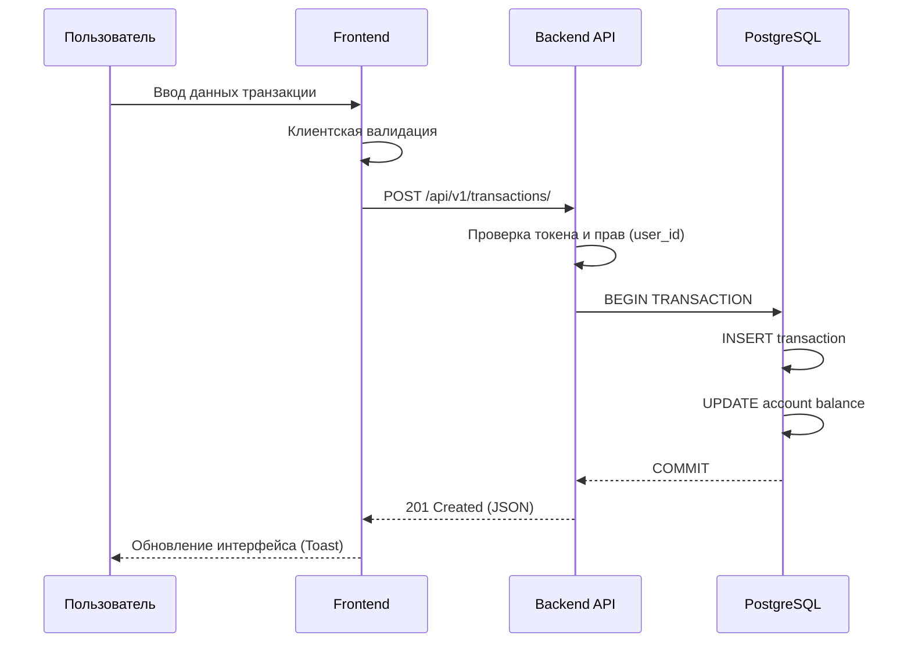

# «CAPITALTRACKER»

---

### 1 Общие сведения

**1.1 Наименование проекта**
Полное наименование: «Программная система для мониторинга денежных потоков, категоризации расходов и планирования личного бюджета». Краткое наименование: «CapitalTracker».

**1.2 Основание для выполнения работ**
Основанием для выполнения разработки является рабочая программа дисциплины «Программная инженерия», результаты защиты лабораторной работы № 1 и требования лабораторной работы № 2. ТЗ оформляется с учетом стандартов ГОСТ 19.201-78, который устанавливает строгий состав и порядок оформления технического задания.

**1.3 Команда проекта и стейкхолдеры**

| Участник | Роль в проекте | Зона ответственности |
| :--- | :--- | :--- |
| Павловский Иван Юрьевич | Team Lead, Backend | Сбор требований, архитектура БД, реализация REST API, интеграция SQLAlchemy. |
| Ларченко Иван Михайлович | Frontend, QA | Проектирование UI/UX, клиентская логика (JS), написание интеграционных тестов. |

**Целевая аудитория:** физические лица, заинтересованные в систематизации учета своих доходов и расходов, которым нужен единый ручной инструмент контроля по нескольким счетам без передачи данных третьим лицам.

**1.4 Цель и задачи**
Цель — создать легкое, высокопроизводительное и наглядное веб-приложение для ручного финансового учета, планирования личного бюджета и жесткого контроля расходов.
Задачи:
1. Формализовать сущности пользователей, счетов, категорий, операций и лимитов.
2. Обеспечить строгую изоляцию персональных данных (по `user_id`).
3. Описать алгоритмы и правила изменения остатков при расходах, доходах и внутренних переводах.
4. Подготовить проверяемые критерии качества программного обеспечения.

**1.5 Этапы жизненного цикла**

| Этап | Выполняемые работы | Результат этапа |
| :--- | :--- | :--- |
| Анализ | Сбор функциональных требований, формализация бизнес-процессов. | Актуализированное ТЗ |
| Проектирование | Разработка ER-диаграммы БД, спецификации API, макетов интерфейса. | Архитектура БД, API, UI |
| Реализация | Написание кода бэкенда (FastAPI) и фронтенда (HTML/JS). | Рабочий релиз (MVP) |
| Тестирование | Проведение модульного и сценарного тестирования. | Протокол испытаний |
| Развертывание | Упаковка сервисов в контейнеры, настройка сети. | Docker Compose конфигурация |
| Приемка | Демонстрация функционала заказчику (преподавателю). | Результат сдачи лабораторной |

---

### 2 Назначение разработки

**2.1 Проблематика**
Разработка системы инициирована для решения следующих проблем учета личных финансов:
1. Финансовые данные распределены между множеством банковских счетов, карт и наличными накоплениями.
2. Мелкие повседневные операции неудобно и долго вести в классических табличных процессорах (Excel).
3. Отсутствует единый автоматизированный контроль месячных лимитов по конкретным категориям трат.
4. Существует потребность в мгновенной сводке по совокупному капиталу в любой момент времени.

**2.2 Эксплуатационное назначение**
CapitalTracker — учетно-аналитический веб-сервис. Пользователь вручную регистрирует доходы, расходы и переводы, ведет справочник категорий и устанавливает бюджеты, а также просматривает графическую аналитику.
Система принципиально не выполняет реальные банковские платежи, не подключается к шлюзам банков и не требует ввода чувствительных банковских реквизитов (номеров карт, CVC-кодов). Это гарантирует максимальную безопасность и сохраняет исходную структуру классического ручного финансового трекера.

**2.3 Границы системы**

| Входит в MVP (Реализуется) | Вне MVP (Не реализуется) |
| :--- | :--- |
| Изолированные личные кабинеты с авторизацией | Интеграция с банковскими шлюзами и API банков |
| Управление счетами и ручной ввод операций | Выполнение реальных денежных транзакций |
| Категоризация трат и установка месячных бюджетов | Автоматическое распознавание бумажных чеков |
| Дашборд и графическая аналитика (Chart.js) | Совместный (семейный) общий счет |

**2.4 Основные принципы работы ядра**
1. Только ручной ввод операций для полного контроля пользователя.
2. Баланс счета может уходить в отрицательные значения (например, для учета кредитных карт).
3. Внутренний перевод средств между своими счетами не является расходом и не меняет совокупный капитал.
4. Чужие данные абсолютно недоступны на уровне БД и контроллеров API.
5. Любое удаление или изменение существующей транзакции динамически корректирует остаток на привязанном счете.

---

### 3 Описание системы и архитектура

**3.1 Ролевая модель доступа**

| Роль | Доступные права и функции |
| :--- | :--- |
| Гость | Просмотр промо-страницы, регистрация новой учетной записи, вход в систему. |
| Владелец | Полное управление своими счетами, CRUD-операции с транзакциями, категориями и бюджетами, выгрузка аналитики. |

**3.2 Пользовательский интерфейс**
Интерфейс разделен на 6 ключевых представлений:
* **Dashboard** — сводка по совокупному капиталу, последние 5 операций, быстрый ввод новой транзакции.
* **Accounts** — управление счетами (создание, редактирование) и безопасное архивирование.
* **Transactions** — полный журнал операций, система многофакторных фильтров, сквозной поиск.
* **Budgets** — установка месячных лимитов и прогресс-бары их расхода.
* **Analytics** — круговые и столбчатые диаграммы распределения средств.
* **Auth** — безопасные формы регистрации и входа с валидацией.

**3.3 Архитектура КПС**
Применяется классическая трехзвенная архитектура. Клиент использует HTML5, Bootstrap 5, Vanilla JavaScript и Chart.js. Сервер маршрутизирует запросы через FastAPI. Хранилище реализовано на базе SQLAlchemy с использованием PostgreSQL для целевого режима развертывания.

```mermaid
graph TD
    subgraph Сеть Абонента
        A[Веб-браузер Пользователя]
    end

    subgraph Docker Compose Окружение (ИВТ-262)
        C[Frontend / Шаблоны Jinja2]
        D[FastAPI Backend Container]
        E[(PostgreSQL 15 Container)]
    end

    A -- HTTP/HTTPS --> C
    C -- REST API / JSON --> D
    D -- SQLAlchemy ORM / TCP 5432 --> E
```
*Рисунок 1. Архитектура программной системы CapitalTracker*

**3.4 Сценарии использования (Use Cases)**

**Сценарий 3.4.1: Добавление финансовой транзакции (Расход/Доход)**

| Атрибут | Описание |
| :--- | :--- |
| **Действующие лица:** | Владелец (Авторизованный пользователь) |
| **Объекты взаимодействия:** | UI CapitalTracker, FastAPI, PostgreSQL |
| **Предусловия:** | Пользователь авторизован, в системе создан минимум один активный счет и категория. |
| **Инициируется:** | Пользователем через нажатие кнопки «Добавить операцию». |
| **Производительность:** | Цикл пересчета остатков на счетах и ответ сервера занимает $\le 150$ мс. |

**Пошаговый сценарий обработки транзакции:**
1. Пользователь через интерфейс открывает модальное окно добавления транзакции.
2. Вводит сумму, выбирает тип (Доход/Расход/Перевод), счет списания и категорию.
3. Frontend проводит базовую валидацию (сумма > 0) и отправляет POST-запрос.
4. Сервер (FastAPI) извлекает JWT-токен пользователя и удостоверяется в принадлежности счета (`account.user_id == current_user.id`).
5. В рамках единой транзакции БД (ACID-свойства СУБД):
   - Записывается новая строка в таблицу `Transaction`.
   - Обновляется поле `balance` в таблице `Account`.
6. Сервер фиксирует транзакцию (COMMIT) и возвращает `HTTP 201 Created`.
7. DOM-дерево интерфейса обновляется без полной перезагрузки страницы.


*Рисунок 2. Диаграмма последовательности фиксации транзакции*

**3.5 Сквозной пользовательский сценарий**
Пользователь создает два счета: «Наличные» (баланс 60 000 руб.) и «Карта» (баланс 5 000 руб.). Общий капитал равен 65 000 руб. Устанавливает месячный лимит на категорию «Продукты» в размере 10 000 руб. Вносит расход 800 руб. по категории «Продукты» с «Карты». Остаток на Карте становится 4 200 руб, индикатор бюджета заполняется на 8%, общий капитал равен 64 200 руб. Затем пользователь переводит 3 000 руб. из «Наличных» на «Карту». Совокупный капитал при межбалансовом переводе не меняется и остается 64 200 руб.

---

### 4 Требования к программе

**4.1 Функциональные требования**

| ID требования | Наименование функции |
| :--- | :--- |
| REQ-AUTH-01 | Безопасная регистрация нового пользователя в системе. |
| REQ-AUTH-02 | Аутентификация, выдача токенов и поддержание сессии. |
| REQ-ACC-01 | Создание и редактирование финансовых счетов пользователя. |
| REQ-ACC-02 | Логическое архивирование счета (скрытие без потери истории). |
| REQ-TX-01 | Регистрация доходов и расходов с пересчетом баланса. |
| REQ-TX-02 | Оформление внутренних межбалансовых переводов. |
| REQ-TX-03 | Корректировка и удаление транзакции с автоматическим откатом баланса. |
| REQ-CAT-01 | Управление пользовательскими категориями. |
| REQ-BDG-01 | Установка лимита месячного бюджета на категорию. |
| REQ-BDG-02 | Цветовая индикация превышения или риска перерасхода бюджета. |
| REQ-REP-01 | Многофакторная фильтрация журнала и сквозной поиск. |
| REQ-REP-02 | Построение графической аналитики капиталовложений. |

**4.2 Данные и бизнес-правила (Модель предметной области)**

| Сущность БД | Основные атрибуты | Ограничения и связи |
| :--- | :--- | :--- |
| **User** | `id`, `username`, `email`, `password_hash` | Хранятся исключительно bcrypt-хэши паролей. Уникальный email. |
| **Account** | `id`, `user_id`, `name`, `type`, `balance`, `is_archived` | Связь ForeignKey с User. При удалении скрывается, если есть история. |
| **Category** | `id`, `user_id`, `name`, `direction` | `direction` определяет назначение (Income / Expense). |
| **Transaction** | `id`, `user_id`, `type`, `amount`, `account_id`, `to_account_id`, `category_id`, `timestamp` | Поле `to_account_id` используется исключительно для типа «Transfer». |
| **BudgetLimit** | `id`, `user_id`, `category_id`, `month`, `year`, `limit_amount` | Жесткая привязка к связке "Категория + Календарный месяц + Год". |

**4.3 Надежность и безопасность**
1. Данные хранятся в реляционной нормализованной СУБД (PostgreSQL).
2. Резервное копирование выполняется перед применением миграций схемы (Alembic).
3. Пароли пользователей не сохраняются в открытом виде (используется алгоритм bcrypt с солью).
4. Программный код взаимодействует с БД только через ORM SQLAlchemy 2.0, что нативно защищает от SQL-инъекций.
5. Интегрирована защита от атак XSS/CSRF через экранирование шаблонов и механизмы защищенных куки. Все секреты (ключи шифрования, пароли БД) вынесены в файл `.env`.

**4.4 Производительность и совместимость**

| Параметр системы | Минимальное требование |
| :--- | :--- |
| Время полной отрисовки Dashboard | $\le 1.0$ с при локальном развертывании. |
| Задержка сохранения транзакции | $\le 150$ мс (учитывая транзакцию СУБД). |
| Интерфейс пользователя | Полностью адаптивный (Flexbox/Grid). |
| Операционная система клиента | Windows 10/11, macOS, Linux, iOS, Android. |
| Веб-браузер клиента | Современные версии Chrome, Firefox, Safari, Yandex. |
| Среда разработки сервера | Python 3.11+. |
| СУБД | SQLite (разработка) / PostgreSQL 15 (продакшен). |

---

### 5 Состав работ по доработке (Лабораторная работа №2)

Reference-проектом для второй лабораторной работы выступает исходная версия сервиса CapitalTracker. Исходный проект успешно решает задачи учета операций, контроля бюджетов и построения графиков, однако является замкнутой средой: в ней отсутствует функция выгрузки пользовательских данных во внешние форматы для последующего статистического анализа. На основании этого выбрана самостоятельная комплексная доработка.

**5.1 Новая функция: Экспорт журнала транзакций в CSV**
Пользователь, применив любые доступные фильтры в интерфейсе журнала (например, выбрав определенный месяц, конкретный счет или категорию), сможет нажать кнопку экспорта и загрузить себе на устройство выборку в формате CSV UTF-8.

| Аспект реализации | Reference-проект (До) | Результат доработки (После) |
| :--- | :--- | :--- |
| Журнал операций | Только просмотр записей и HTML-фильтрация. | Появление кнопки аппаратной выгрузки отфильтрованной выборки. |
| Формат данных | HTML таблицы / JSON API. | Скачиваемый файл `*.csv` с кодировкой UTF-8. |
| Безопасность | Проверка прав при рендере HTML. | Строгая проверка `user_id` при генерации файла выгрузки на уровне SQL-ядра. |

**5.2 Состав технических работ**
1. Разработка нового API-эндпоинта (`GET /api/v1/transactions/export`), принимающего query-параметры фильтров.
2. Реализация проверки `user_id` сессии, чтобы исключить возможность скачивания чужого журнала путем подмены параметров.
3. Использование библиотеки Python `csv` и `io.StringIO` для динамического формирования строковых данных в памяти сервера без сохранения временных файлов на диск. Настройка `StreamingResponse`.
4. Интеграция кнопки выгрузки в пользовательский интерфейс (обработка Blob-объекта через JavaScript).
5. Написание интеграционных тестов и обновление программной документации (Swagger).

---

### 6 Состав работ по развертыванию

Приоритетный вариант развертывания программного обеспечения — веб-среда с использованием системы контейнеризации **Docker Compose**. Данный подход обеспечивает полную изоляцию приложения и предсказуемость окружения на компьютерах студента и преподавателя, исключая проблемы с зависимостями ОС.

**6.1 Требования к окружению**
- Установленный Docker Desktop (для Windows/macOS) или Docker Engine + плагин Compose (для Linux).
- Система контроля версий Git.
- Современный веб-браузер.
- Свободные сетевые порты `8000` (для маршрутизации FastAPI) и `5432` (для PostgreSQL).
- Настроенный файл конфигурации `.env` по предоставленному шаблону.

**6.2 Порядок запуска системы**
1. Получить исходный код: `git clone <URL_репозитория>`.
2. Перейти в корень загруженного проекта: `cd capital-tracker`.
3. Подготовить переменные окружения, скопировав `.env.example` в `.env`.
4. Запустить сборку образов и старт контейнеров: `docker compose up --build -d`.
5. Дождаться инициализации базы данных и веб-сервера (приложение автоматически выполнит `alembic upgrade head`).
6. Открыть веб-интерфейс в браузере по адресу `http://localhost:8000`.
7. Выполнить проверку приемочными тестами.

**6.3 Матрица проверки корректности запуска**

| Зона проверки | Ожидаемый результат после развертывания |
| :--- | :--- |
| Состояние контейнеров | `docker compose ps` показывает статус `Up` / `healthy` for `db` и `web`. |
| Доступность страницы | Страница `http://localhost:8000` отдает статус 200 OK без ошибок в консоли браузера. |
| Регистрация и СУБД | Пользователь успешно создается, данные персистентно сохраняются в СУБД. |
| Функционал экспорта | CSV-файл скачивается и содержит кириллицу в читаемом виде. |

**6.4 Повторный запуск и хранение данных**
Для корректной остановки сервисов используется команда `docker compose down`. Для последующего запуска — `docker compose up -d`. Важно: данные базы PostgreSQL сохраняются в именованном томе (Volume) целевой конфигурации, поэтому при перезапусках финансовая история не стирается (если не использовать деструктивный флаг `-v`).

---

### 7 Порядок контроля и приемки

Контроль и приемка разрабатываемого ПО регламентируются ГОСТ 19.201-78, который требует указывать виды испытаний, критерии оценки и общие требования к сдаче продукта. Для проверки используется ручное сценарное тестирование.

**7.1 Как определить штатное и внештатное поведение**
1. Фиксировать исходное предусловие, выполняемое действие и ожидаемый результат.
2. Тестировать как положительные («счастливый путь»), так и отрицательные (ввод неверных типов данных) сценарии.
3. Сверять изменения в UI, статус-коды HTTP-ответов и фактическое состояние базы данных.
4. Проверять устойчивость системы (рестарт контейнеров).
5. Строго проверять изоляцию (попытку доступа к ID транзакции, принадлежащей другому аккаунту).

**7.2 Критерии разграничения штатного и внештатного поведения**

| Область проверки | Штатное (ожидаемое) поведение | Внештатное (сбойное) поведение |
| :--- | :--- | :--- |
| **Авторизация** | Доступ предоставляется только к своему профилю и счетам. | Предоставление доступа к ресурсам без токена авторизации. |
| **Транзакции** | Точный пересчет баланса, отклонение (HTTP 400) при вводе некорректной суммы без падения сервера. | Потеря транзакции, сохранение математически неверного баланса. |
| **Межбалансовый перевод** | Строгая атомарность: списание и зачисление происходят одновременно. | Изменена только одна сторона перевода (деньги пропали или удвоились). |
| **Экспорт CSV (Новое)** | Файл содержит исключительно данные текущего пользователя. | Файл содержит данные других людей или структуру всей базы данных. |
| **Надежность системы** | Сохранение всех введенных данных после выполнения `docker compose down/up`. | Полная потеря истории пользователя после перезапуска контейнера базы. |

**7.3 Приемочные испытания (Сценарии)**

| № | Действие тестировщика | Ожидаемый результат испытания |
| :-: | :--- | :--- |
| 1 | Регистрация с уже существующим email. | Возврат HTTP 400, дублирующая учетная запись отсутствует. |
| 2 | Ввод суммы транзакции `0` или `-150`. | Серверное отклонение (Unprocessable Entity), баланс не меняется. |
| 3 | Создание расхода на `1 200` руб. при балансе 10 000 руб. | Транзакция сохранена, остаток счета автоматически равен `8 800` руб. |
| 4 | Внутренний перевод на `2 500` руб. | Средства перемещены, совокупный капитал (виджет дашборда) постоянен. |
| 5 | Прямой запрос к транзакции с чужим ID. | Возврат ошибки HTTP 403 Forbidden / 404 Not Found. |
| 6 | Удаление подтвержденного расхода. | Сумма расхода корректно возвращена на баланс счета. |
| 7 | Удаление счета, у которого есть история операций. | Физическое удаление заблокировано, счет переведен в статус «Архив». |
| 8 | Создание расхода, превышающего бюджет категории. | Индикатор прогресс-бара меняет цвет на красный (перерасход). |
| 9 | Применение фильтра «Январь 2026». | Точная выборка записей, исключающая другие даты. |
| 10 | Перезапуск докер-контейнеров. | Все данные СУБД сохранены и загружаются штатно. |
| 11 | **Экспорт (Доработка)**. | Скачивается CSV UTF-8 текущей выборки без нарушения кодировки. |

**7.4 Критерий успешной приемки программного продукта**
Программный продукт считается успешно сданным Заказчику (преподавателю), если система бесперебойно запускается на независимом ПК с помощью штатных команд Docker Compose, все 11 обязательных сценариев приемочных испытаний проходятся без возникновения критических (HTTP 500) дефектов, а заявленный модуль выгрузки CSV работает стабильно и не нарушает принципы изоляции персональных данных.

---

### 8 Гарантийная поддержка

В рамках учебного процесса (лабораторные работы по программной инженерии) гарантийная поддержка предоставляется командой авторов проекта вплоть до финальной защиты. Поддержка включает оперативное устранение дефектов, выявленных преподавателем или нормоконтролером при проверке.

**8.1 Регламент обращения по инцидентам**
При выявлении дефекта необходимо зафиксировать:
1. Подробные шаги для воспроизведения проблемы.
2. Ожидаемый и фактический результат.
3. Версию релиза или хеш коммита в Git.
4. Приложить скриншот консоли браузера или журнала логов Docker.

**8.2 Классификация и приоритеты инцидентов**

| Уровень приоритета | Описание ситуации и сроки реакции |
| :--- | :--- |
| **Критичный (Blocker)** | Нет запуска контейнеров, ошибка структуры БД, потеря основного учета (не работает логин, не сохраняются расходы). Устраняется в первую очередь. |
| **Высокий (Major)** | Нарушена ключевая функция, например: математически неверный пересчет баланса, не работает выгрузка CSV. Устраняется до следующей итерации защиты. |
| **Стандартный (Minor)** | Некритичный дефект: съехавшая верстка на специфическом разрешении экрана, опечатка в тексте ошибки. |

**8.3 Политика резервирования**
Перед применением миграций БД (`alembic upgrade`) Исполнителю рекомендуется создавать резервную копию текущего тома данных. Исходная архитектура проекта предусматривает логическое резервирование перед внесением деструктивных изменений в схему.

---

### 9 Требования к программной документации

**9.1 Состав пакета документации**

| Документ | Назначение и суть |
| :--- | :--- |
| **ТЗ (Текущий документ)** | Детальное описание требований, функционала, архитектуры и критериев приемки. |
| **README.md** | Обзор проекта в корне Git-репозитория и инструкция для разработчиков. |
| **Руководство запуска** | Технические спецификации для работы с Docker Compose и переменными `.env`. |
| **Программа испытаний** | Формализованные сценарные тест-кейсы для оценки штатного поведения. |
| **Спецификация API** | Автоматически генерируемая OpenAPI (Swagger) документация по адресу `/docs`. |

**9.2 Оформление документации**
Текстовая документация должна соответствовать следующим правилам:
1. Язык написания — русский (термины и переменные могут быть на английском).
2. Поддержание единой терминологии во всем проекте.
3. Наличие нумерации таблиц и архитектурных рисунков.
4. Использование стандарта Markdown (или DOCX) для разметки.
5. Соблюдение структуры ГОСТ 19.201-78 в части описания стадий жизненного цикла и состава работ.

---

### 10 Требования к исполнителю

**10.1 Необходимые компетенции и применяемый инструментарий**

| Направление | Инструмент / ПО | Выполняемые функции и задачи |
| :--- | :--- | :--- |
| **Контроль версий** | Git, GitHub | Хранение исходного кода, ведение независи веток по методологии GitHub Flow, использование трекера задач (Issues). |
| **Среда разработки** | VS Code, PyCharm | Написание и рефакторинг логики бэкенда, отладка исполнения кода внутри изолированных контейнеров. |
| **Статический анализ** | Ruff, Mypy | Автоматический жесткий контроль соответствия кода стандарту PEP 8 и проверка статической типизации Python. |
| **Контейнеризация** | Docker, Docker Compose | Сборка изолированных легковесных образов (alpine/slim) и унифицированный запуск на ПК студента и преподавателя без конфликтов сред. |
| **Управление СУБД** | DBeaver, pgAdmin | Проектирование нормализованной схемы реляционной базы данных, написание и отладка сложных SQL-запросов. |
| **Тестирование API** | FastAPI Docs (Swagger) | Автоматическая генерация интерактивной документации OpenAPI и ручная верификация возвращаемых HTTP статус-кодов. |

---
*Авторы проекта: студенты гр. ИВТ-262 ВолгГТУ Павловский И. Ю., Ларченко И. М. (2026 г.)*
